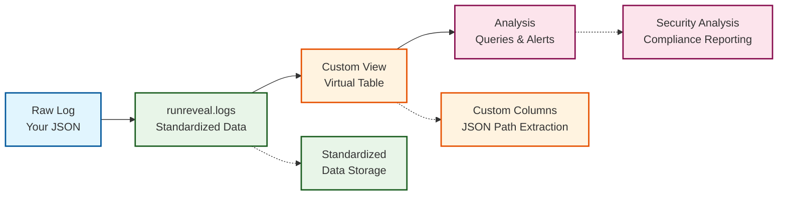

import { Callout, Tabs, Steps } from 'nextra/components'

# Custom Views

Custom Views allow you to create virtual tables that extract specific fields from your log data using JSON path expressions. This feature enables you to organize and analyze your log data with custom columns tailored to your specific use cases, without modifying the underlying data structure.

<Callout type="warning">
<strong>Feature Flag Required</strong>: Custom Views is currently gated behind a feature flag. Please reach out to RunReveal support to request access to this feature.
</Callout>

<Callout type="info">
<strong>Getting Started</strong>: Navigate to <strong>Settings → Custom Views</strong> to create your first custom view, or use the CLI and API for programmatic access.
</Callout>

## Key Features

- **Virtual Tables**: Create queryable views without data transformation
- **JSON Path Extraction**: Extract nested fields from your raw logs
- **Source Filtering**: Views automatically filter to specific sources
- **Real-time Analysis**: Query-time extraction for immediate insights
- **Flexible Schema**: Add custom columns for any JSON field in your logs


## Architecture



## Creating Custom Views

### Via Web UI

<Steps>

### 1) Navigate to Custom Views

Go to **Settings → Custom Views** and click **"Create Custom View"**.

### 2) Configure Basic Information

Fill in the basic information:
- **Name**: Descriptive name for your view
- **Description**: Optional description of the view's purpose
- **Source**: Select the source to filter logs from

### 3) Add Custom Columns

Add custom columns with:
- **Column Name**: Name for the extracted field
- **Type**: ClickHouse data type (String, Int64, Bool, etc.)
- **SQL Expression**: JSON path to extract the field
- **Description**: Optional description of the column

### 4) Test and Save

Test your view with sample data, then save your configuration.

</Steps>


## Column Configuration

### Supported Data Types

| Type | Description | Example |
|------|-------------|---------|
| `String` | Text data | `"user@example.com"` |
| `Int8/16/32/64` | Signed integers | `12345` |
| `UInt8/16/32/64` | Unsigned integers | `4294967295` |
| `Float32/64` | Floating point numbers | `3.14159` |
| `Bool` | Boolean value | `true` |
| `DateTime/DateTime64` | Date and time | `2025-01-15 10:30:00` |
| `Date/Date32` | Date only | `2025-01-15` |
| `Array(String)` | Array of strings | `["tag1", "tag2"]` |
| `Nullable(String)` | Nullable string | `null` or `"value"` |
| `LowCardinality(String)` | Memory-optimized string | `"frequent_value"` |

### JSON Path Expressions

Custom views support simple JSON path expressions to extract nested fields:

#### Basic Syntax
```
field.subfield.array[0].nested_field
```

#### Examples
```json
{
  "user": {
    "profile": {
      "email": "user@example.com"
    }
  },
  "tags": ["security", "alert"],
  "metadata": {
    "source_ip": "192.168.1.100"
  }
}
```

**Valid JSON Paths:**
- `user.profile.email` → `"user@example.com"`
- `tags[0]` → `"security"`
- `metadata.source_ip` → `"192.168.1.100"`

#### Advanced SQL Expressions
While JSON paths are simple, you can use ClickHouse functions in SQL expressions:

```sql
-- Simple JSON path
user.email

-- ClickHouse function
toString(user.id)

-- Conditional logic
if(user.role = 'admin', 'high', 'low')

-- Array operations
arrayJoin(user.permissions)
```

#### Limitations
- **Simple Paths**: Direct field access and array indexing only
- **No Complex Logic**: Cannot use conditional statements in path expressions
- **ClickHouse Functions**: Can use ClickHouse functions in SQL expressions
- **Path Length**: Maximum 256 characters

## Example: Application Security Custom View

### Use Case
Extract important security fields from application logs for analysis and monitoring.

### Sample Raw Log
```json
{
  "timestamp": "2024-01-15T10:30:00Z",
  "level": "INFO",
  "service": "auth-service",
  "user": {
    "id": "12345",
    "email": "john.doe@company.com",
    "role": "admin"
  },
  "request": {
    "method": "POST",
    "path": "/api/v1/login",
    "ip": "192.168.1.100",
    "user_agent": "Mozilla/5.0..."
  },
  "response": {
    "status": 200,
    "duration_ms": 150
  },
  "security": {
    "risk_score": 0.2,
    "threats": ["none"],
    "location": {
      "country": "US",
      "city": "San Francisco"
    }
  }
}
```

### Configuration

**Basic Information:**
- **Name**: `app_security_analysis`
- **Description**: `Application security events analysis`
- **Source**: Your application source

**Custom Columns:**
```json copy
[
  {
    "name": "user_email",
    "description": "User email address",
    "type": "String",
    "sql": "user.email"
  },
  {
    "name": "user_role",
    "description": "User role or permission level",
    "type": "String",
    "sql": "user.role"
  },
  {
    "name": "request_ip",
    "description": "Client IP address",
    "type": "String",
    "sql": "request.ip"
  },
  {
    "name": "response_status",
    "description": "HTTP response status code",
    "type": "Int64",
    "sql": "response.status"
  },
  {
    "name": "response_duration",
    "description": "Request duration in milliseconds",
    "type": "Int64",
    "sql": "response.duration_ms"
  },
  {
    "name": "risk_score",
    "description": "Security risk score (0-1)",
    "type": "Float64",
    "sql": "security.risk_score"
  },
  {
    "name": "is_high_risk",
    "description": "Whether the event is high risk",
    "type": "Bool",
    "sql": "security.risk_score > 0.7"
  },
  {
    "name": "country",
    "description": "User's country",
    "type": "String",
    "sql": "security.location.country"
  }
]
```

## Querying Custom Views

### View Naming Convention
Custom views use the exact name you provide. No workspace prefix is added automatically.

Example: If you create a view named `app_security_analysis`, it will be accessible as:
```sql
SELECT * FROM app_security_analysis LIMIT 10;
```

### Basic Queries

```sql copy
-- Get all records from the custom view
SELECT * FROM app_security_analysis LIMIT 10;

-- Get specific columns
SELECT 
  eventTime,
  user_email,
  user_role,
  request_ip,
  response_status
FROM app_security_analysis
ORDER BY eventTime DESC;
```

### Security Analysis Queries

```sql copy
-- Find high-risk events
SELECT 
  eventTime,
  user_email,
  user_role,
  request_ip,
  risk_score,
  country
FROM app_security_analysis
WHERE is_high_risk = true
ORDER BY eventTime DESC
LIMIT 100;

-- Find failed authentication attempts
SELECT 
  eventTime,
  user_email,
  request_ip,
  response_status,
  country
FROM app_security_analysis
WHERE response_status = 401
ORDER BY eventTime DESC;

-- Find admin users from unusual locations
SELECT 
  eventTime,
  user_email,
  request_ip,
  country,
  risk_score
FROM app_security_analysis
WHERE user_role = 'admin'
  AND country NOT IN ('US', 'CA', 'GB')
ORDER BY risk_score DESC;
```

## Combining with Transforms

### Best Practice: Hybrid Approach

Use **transforms** for standard field mapping and **custom views** for source-specific analysis:

#### Transform (Data Normalization)
```json copy
{
  "processors": [
    {
      "type": "field_mapper",
      "config": {
        "mappings": [
          {
            "source": "service",
            "target": "serviceName"
          },
          {
            "source": "request.ip",
            "target": "srcIP"
          },
          {
            "source": "user.email",
            "target": "actor.email"
          },
          {
            "source": "request.path",
            "target": "eventName"
          }
        ]
      }
    }
  ]
}
```

#### Custom View (Analysis Enhancement)
```json copy
[
  {
    "name": "risk_score",
    "type": "Float64",
    "sql": "security.risk_score"
  },
  {
    "name": "is_high_risk",
    "type": "Bool", 
    "sql": "security.risk_score > 0.7"
  },
  {
    "name": "country",
    "type": "String",
    "sql": "security.location.country"
  }
]
```

### Benefits
- **Standard Fields**: Work with existing RunReveal detections
- **Custom Fields**: Enable advanced source-specific analysis
- **Flexibility**: Query either standard table or custom view as needed

## Using Custom Views in Detections

Custom views can be targeted in detection rules:

```yaml copy
title: High-Risk Authentication Events
detection:
  selection:
    is_high_risk: true
    user_role: admin
    country:
      - "CN"
      - "RU"
      - "KP"
  condition: selection
sourcenames:
  - your_app_source
```


## Troubleshooting

### Common Issues

#### "Invalid JSON path" Error
- **Cause**: JSON path syntax is incorrect
- **Solution**: Use simple dot notation: `field.subfield.array[0]`

#### "No rows in result set"
- **Cause**: No logs match the source filter or time range
- **Solution**: Check source is active and has recent logs

#### "Column not found" Error
- **Cause**: Column name doesn't exist in the view
- **Solution**: Verify column names match the custom view definition


## Next Steps

Now that you understand custom views, explore these related features:

- **[Transforms](/transforms)**: For data normalization and field mapping
- **[Detections](/detections)**: For alerting on custom view data  
- **[Pipelines](/pipelines)**: For complex data processing workflows
- **[Dashboards](/dashboards)**: For visualizing your custom view data
