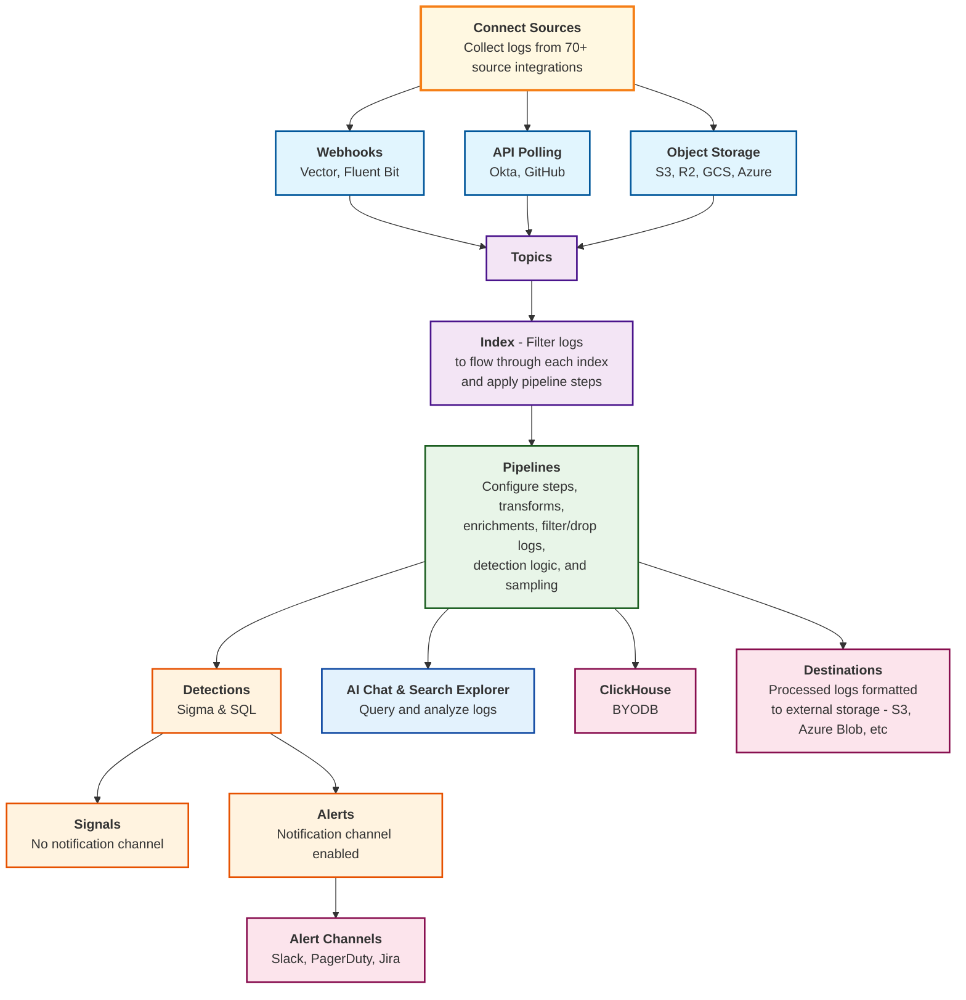

# RunReveal Platform Onboarding Guide

RunReveal is a **modern security data platform built on ClickHouse** that eliminates traditional SIEM complexity while delivering detection-as-code, AI-powered investigations, and sub-second query performance at scale. This onboarding guide will walk you through setting up your workspace, connecting data sources, configuring detections, and getting your team productive with RunReveal in just a few hours.

## How logs flow through RunReveal

Follow this step-by-step process to get your team up and running with RunReveal:




## Table of Contents

1. [Initial Setup and Account Creation](#1-initial-setup-and-account-creation)
2. [Inviting Team Members](#2-inviting-team-members)
3. [Connecting Data Sources](#3-connecting-data-sources)
4. [Understanding Topics, Pipelines, and Transforms](#4-understanding-topics-pipelines-and-transforms)
5. [Configuring Detections and Alerts](#5-configuring-detections-and-alerts)
6. [Exploring Dashboards and Reports](#6-exploring-dashboards-and-reports)
7. [Training and Support](#7-training-and-support)
8. [Advanced Features to Explore](#8-advanced-features-to-explore)
9. [Onboarding Completion Checklist](#onboarding-completion-checklist)

### 1. Initial Setup and Account Creation

#### Step 1: Create Your Account
1. Navigate to https://app.runreveal.com
2. Click "Sign Up" and enter your email address
3. Check your email for the verification link
4. Complete account setup with your name and company

#### Step 2: Workspace Setup
Your workspace will be automatically created with:
- **Name**: "your-email's Workspace" (e.g., "john@company.com's Workspace")
- **Admin Role**: You're automatically assigned as administrator
- **Default Notifications**: Email notification channel is created

#### Step 3: Verify Your Setup
1. **Check Your Workspace**: 
   - Go to **Settings** in your RunReveal dashboard
   - Verify your workspace name and admin role are displayed correctly
2. **Confirm Email Notifications**:
   - Go to **Notifications** in your dashboard
   - Verify the default email notification channel is created and active
3. **Access Workspace Settings**:
   - Go to **Settings** → **Workspace Details**
   - Note your workspace ID for future reference

### 2. Inviting Team Members

#### Step 1: Understand Available Roles
- **Admin**: Full administrative control including workspace management and user administration
- **Analyst**: Detection creation, modification, and analysis capabilities
- **Operator**: Operational tasks including query execution and report management
- **CIBot**: Automated system access for CI/CD pipelines and integrations

#### Step 2: Invite Users via Dashboard
1. Go to **Admin → Users** in your RunReveal dashboard
2. Click **"Invite User"**
3. Enter email address and select role
4. Click **"Send Invitation"**

#### Step 3: Verify User Invitations
1. **Check Invitation Status**:
   - Go to **Admin → Users** in your dashboard
   - View the list of invited users and their status
   - **Active**: User has accepted invitation and is active
   - **Pending**: User has not yet accepted the invitation
2. **Monitor User Activity**:
   - Go to **Admin → Users** to see all workspace members
   - Check user roles and last login times
   - Verify each user has the correct role assigned

#### Step 4: User Acceptance Process
1. Invited user receives email with invitation link
2. User clicks link and creates account
3. User is automatically added to workspace with assigned role
4. You'll receive notification when user accepts invitation

### 3. Connecting Data Sources

#### Step 1: Choose Your First Source
**Recommended for beginners** (easiest to set up):
- **Okta**: Identity and access management logs
- **AWS CloudTrail**: Cloud infrastructure activity
- **GitHub**: Development and security events

#### Step 2: Set Up Okta Integration (Example)
1. Go to **Sources** in your RunReveal dashboard
2. Click **"Add Source"** → **"Okta"**
3. **Get API Token from Okta**:
   - Log into Okta Admin Console
   - Go to **Security → API → Tokens**
   - Click **"Create Token"**
   - Name it "RunReveal Integration"
   - Copy the token (starts with `SSWS-`)
4. **Configure in RunReveal**:
   - Enter your Okta domain (e.g., `company.okta.com`)
   - Paste the API token
   - Click **"Test Connection"**
   - Click **"Save"**

**Expected Result**: Logs start flowing within 60-120 seconds

#### Step 3: Set Up AWS CloudTrail (Example)
1. **Create CloudFormation Stack**:
   - Use RunReveal's template: https://us-east-2.console.aws.amazon.com/cloudformation/home?region=us-east-2#/stacks/create?templateURL=https://runreveal-public-assets.s3.us-east-2.amazonaws.com/runreveal-cloudformation.yml&stackName=RunRevealSetup
   - Stack name: `RunRevealSetup`
   - Click **"Create Stack"**
2. **Add Source in RunReveal**:
   - Go to **Sources** → **"Add Source"** → **"AWS CloudTrail"**
   - Enter the S3 bucket name from CloudFormation output
   - Leave Role ARN blank
   - Click **"Save"**

#### Step 4: Set Up S3 Generic Forwarder (Example)
**Use Case**: Custom log formats, application logs, or logs from unsupported sources

1. **Create S3 Bucket**:
   - Go to AWS S3 Console
   - Click **"Create bucket"**
   - Name: `my-company-logs` (must be globally unique)
   - Region: Choose your preferred region
   - Click **"Create bucket"**

2. **Configure S3 Event Notifications**:
   - Go to your bucket → **Properties** → **Event notifications**
   - Click **"Create event notification"**
   - **Event types**: Select **"All object create events"**
   - **Destination**: Select **"SNS topic"**
   - **SNS topic**: `arn:aws:sns:us-east-1:253602268883:runreveal_generic`
   - Click **"Save changes"**

3. **Add RunReveal Source**:
   - Go to **Sources** → **"Add Source"** → **"S3 Generic"**
   - **Bucket Name**: `my-company-logs`
   - **Region**: `us-east-1` (or your bucket's region)
   - **Source Type**: `generic` (or custom name like `app-logs`)
   - Click **"Save"**

4. **Upload Test Logs**:
```bash
# Create sample log file
echo '{"timestamp":"2024-01-15T10:30:00Z","level":"INFO","message":"User login successful","user":"john@company.com","ip":"192.168.1.100"}' > test-log.json

# Upload to S3
aws s3 cp test-log.json s3://my-company-logs/app-logs/2024/01/15/test-log.json
```

5. **Verify Data Flow**:
   - Wait 2-3 minutes after uploading the test log
   - Go to **Explore** in your RunReveal dashboard
   - Run this query: `SELECT COUNT(*) FROM logs WHERE sourceType = 'generic'`
   - You should see a count of 1 (your uploaded log)
   - Run this query to view the log: `SELECT * FROM logs WHERE sourceType = 'generic' ORDER BY receivedAt DESC LIMIT 1`
   - Verify you can see your test log data with the timestamp, level, message, user, and IP fields

#### Step 5: Verify All Data Sources
1. **Check Source Health**:
   - Go to **Sources** in your RunReveal dashboard
   - Verify all your sources show as "Healthy" with green status indicators
   - Check the "Last Data Received" timestamps to ensure logs are flowing
2. **Verify Data Ingestion**:
   - Go to **Explore** in your dashboard
   - Run this query: `SELECT sourceType, COUNT(*) as count FROM logs WHERE receivedAt > now() - INTERVAL 1 HOUR GROUP BY sourceType`
   - You should see counts for each of your connected sources (Okta, CloudTrail, S3 Generic)
3. **View Recent Activity**:
   - Run this query: `SELECT sourceType, eventName, COUNT(*) as count FROM logs WHERE receivedAt > now() - INTERVAL 1 HOUR GROUP BY sourceType, eventName ORDER BY count DESC LIMIT 10`
   - This shows the most common event types from each source

### 4. Understanding Topics, Pipelines, and Transforms

#### What are Topics and Pipelines?
**Topics** are logical groupings of data streams that flow through **Pipelines** - configurable processing workflows that transform, enrich, and route your logs. Think of pipelines as assembly lines for your security data.

#### Step 1: Explore Built-in Topics
RunReveal automatically creates topics for your data sources:
1. **View Topics**:
   - Go to **Topics** in your RunReveal dashboard
   - You'll see topics automatically created for each of your data sources
   - Each topic represents a logical grouping of related log data

**Common Topics**:
- `okta`: Identity and access management events
- `cloudtrail`: AWS API activity
- `github`: Development and security events
- `generic`: Custom logs from S3 or webhooks

#### Step 2: Understanding Pipeline Steps
Pipelines can contain multiple processing steps. Here are the main types:

**1. Transform Steps**
- **Purpose**: Parse, extract, and normalize log data
- **Use Cases**: Convert vendor-specific formats to RunReveal's standard schema

**Example - JSON Parser**:
```yaml
name: "parse-json-logs"
type: "json_parser"
config:
  field: "rawLog"
  target_field: "parsed_data"
```

**Example - Regex Extractor**:
```yaml
name: "extract-ip-addresses"
type: "regex_extractor"
config:
  field: "message"
  pattern: "\\b(?:[0-9]{1,3}\\.){3}[0-9]{1,3}\\b"
  target_field: "extracted_ip"
```

**2. Enrichment Steps**
- **Purpose**: Add contextual information to logs
- **Use Cases**: IP geolocation, user role mapping, asset tagging

**Example - IP Enrichment**:
```yaml
name: "ip-geolocation"
type: "ip_enrichment"
config:
  source_field: "src.ip"
  enrichments:
    - "country"
    - "city"
    - "organization"
```

**Example - Custom Enrichment**:
```yaml
name: "user-role-mapping"
type: "lookup_enrichment"
config:
  source_field: "actor.email"
  lookup_table: "user_roles.csv"
  target_field: "actor.role"
```

**3. Filter Steps**
- **Purpose**: Include or exclude logs based on conditions
- **Use Cases**: Remove noise, focus on specific events, compliance filtering

**Example - Event Filter**:
```yaml
name: "security-events-only"
type: "filter"
config:
  condition: "eventName IN ('user.session.start', 'user.authentication', 'admin.action')"
  action: "include"
```

**Example - Noise Reduction**:
```yaml
name: "remove-health-checks"
type: "filter"
config:
  condition: "src.ip = '127.0.0.1' AND userAgent CONTAINS 'health-check'"
  action: "exclude"
```

**4. Routing Steps**
- **Purpose**: Send logs to different destinations based on conditions
- **Use Cases**: Separate high-value vs low-value logs, compliance archiving

**Example - Severity Routing**:
```yaml
name: "route-by-severity"
type: "router"
config:
  routes:
    - condition: "severity >= 'high'"
      destination: "high-priority-topic"
    - condition: "severity = 'medium'"
      destination: "medium-priority-topic"
    - default: "low-priority-topic"
```

#### Step 3: Create Your First Pipeline
1. **Go to Pipelines** in your RunReveal dashboard
2. **Click "Create Pipeline"**
3. **Configure Basic Settings**:
   - **Name**: "Security Events Pipeline"
   - **Source Topic**: Select your Okta topic
   - **Description**: "Process and enrich security events"

4. **Add Transform Step**:
```yaml
steps:
  - name: "normalize-okta-events"
    type: "field_mapper"
    config:
      mappings:
        "actor.email": "user.email"
        "src.ip": "source.ip"
        "eventTime": "timestamp"
```

5. **Add Enrichment Step**:
```yaml
  - name: "enrich-with-geo"
    type: "ip_enrichment"
    config:
      source_field: "source.ip"
      enrichments: ["country", "city", "organization"]
```

6. **Add Filter Step**:
```yaml
  - name: "security-events-only"
    type: "filter"
    config:
      condition: "eventName IN ('user.session.start', 'user.authentication')"
      action: "include"
```

#### Step 4: Test Your Pipeline
1. **View Your Pipeline**:
   - Go to **Pipelines** in your RunReveal dashboard
   - You should see your "Security Events Pipeline" listed
   - Click on the pipeline to view its configuration and status
2. **Monitor Pipeline Performance**:
   - In the pipeline details view, check the processing metrics
   - Look for processing rates, error rates, and latency information
   - Verify the pipeline is processing logs successfully

**Expected Output**:
```
Pipeline: Security Events Pipeline
Status: active
Processed: 1,247 logs
Filtered: 23 logs
Enriched: 1,224 logs
Processing Time: 45ms average
```

#### Step 5: Common Pipeline Patterns

**Pattern 1: Log Normalization Pipeline**
```yaml
name: "normalize-all-logs"
steps:
  - name: "parse-json"
    type: "json_parser"
  - name: "map-fields"
    type: "field_mapper"
  - name: "add-timestamp"
    type: "timestamp_extractor"
```

**Pattern 2: Security Enrichment Pipeline**
```yaml
name: "security-enrichment"
steps:
  - name: "ip-geolocation"
    type: "ip_enrichment"
  - name: "threat-intel"
    type: "threat_intelligence"
  - name: "user-context"
    type: "user_enrichment"
```

**Pattern 3: Compliance Filtering Pipeline**
```yaml
name: "compliance-filtering"
steps:
  - name: "include-audit-events"
    type: "filter"
    condition: "eventName LIKE '%audit%' OR eventName LIKE '%admin%'"
  - name: "remove-pii"
    type: "pii_redaction"
  - name: "route-to-archive"
    type: "router"
    destination: "compliance-archive"
```

#### Step 6: Monitor Pipeline Performance
1. **View Pipeline Metrics**:
   - Go to **Pipelines** in your RunReveal dashboard
   - Select your pipeline to view detailed metrics
   - Monitor processing rates, error rates, and latency
2. **Check Pipeline Health**:
   - Look for any error indicators or warnings
   - Verify logs are flowing through the pipeline successfully
   - Check that transformations and enrichments are working as expected

**Key Metrics to Monitor**:
- **Processing Rate**: Logs per second
- **Error Rate**: Failed processing percentage
- **Latency**: Time from input to output
- **Filter Rate**: Percentage of logs filtered out

### 5. Configuring Detections and Alerts

#### Step 1: Set Up Notification Channels
1. Go to **Notifications** in your dashboard
2. **Add Email Channel** (already created by default)
3. **Add Slack Channel**:
   - Click **"Add Channel"** → **"Slack"**
   - Enter webhook URL from your Slack workspace
   - Test the connection
   - Save

#### Step 2: Create Your First Detection
1. Go to **Detections** → **"Create Detection"**
2. **Choose Detection Type**: SQL (recommended for beginners)
3. **Fill in Basic Info**:
   - **Name**: "Failed Login Attempts"
   - **Description**: "Alert on multiple failed login attempts"
   - **Severity**: Medium
   - **Schedule**: `*/15 * * * *` (every 15 minutes)

#### Step 3: Write Detection Query
```sql
SELECT 
  actor.email,
  src.ip,
  COUNT(*) as failed_attempts
FROM logs 
WHERE eventName = 'user.session.start'
  AND outcome.result = 'FAILURE'
  AND receivedAt BETWEEN {from:DateTime} AND {to:DateTime}
GROUP BY actor.email, src.ip
HAVING failed_attempts >= 5
```

#### Step 4: Configure Notifications
- **Notification Channels**: Select email and Slack
- **Template**: Use default or customize message
- **Test**: Click "Test Detection" to verify

#### Step 5: Enable and Monitor
1. Click **"Save and Enable"**
2. Monitor in **Detections** dashboard
3. Check **Alerts** tab for triggered detections

**Example Alert Output**:
```
Detection: Failed Login Attempts
Severity: Medium
Time: 2024-01-15 14:30:00
Details: 7 failed attempts from 192.168.1.100 for user@company.com
```

### 6. Exploring Dashboards and Reports

#### Step 1: Explore Built-in Dashboards
1. Go to **Dashboards** in your RunReveal dashboard
2. **Default Dashboards Available**:
   - **Overview**: High-level metrics and recent activity
   - **Security Events**: Failed logins, suspicious activity
   - **Source Health**: Data flow status from all sources

#### Step 2: Run Your First Query
1. Go to **Explore** tab
2. **Try this example query**:
```sql
SELECT 
  eventName,
  COUNT(*) as event_count
FROM logs 
WHERE receivedAt > now() - INTERVAL 24 HOUR
GROUP BY eventName
ORDER BY event_count DESC
LIMIT 10
```

**Expected Output**:
```
┌─eventName─────────────┬─event_count─┐
│ user.session.start    │         245 │
│ user.session.end      │         198 │
│ user.authentication   │          67 │
└───────────────────────┴────────────┘
```

#### Step 3: Set Up Grafana Integration (Optional)
1. **Install Grafana Plugin**:
   ```bash
   grafana-cli plugins install runreveal-runreveal-datasource
   ```
2. **Configure Data Source**:
   - Go to Grafana → Configuration → Data Sources
   - Add "RunReveal" data source
   - Enter your API token from https://app.runreveal.com/dash/workspace/api-tokens
   - Test connection

#### Step 4: Create Custom Dashboard
1. In RunReveal, go to **Dashboards** → **"Create Dashboard"**
2. **Add Widgets**:
   - **Time Series**: Login attempts over time
   - **Table**: Top users by activity
   - **Counter**: Total events today
3. **Save Dashboard** with a descriptive name

#### Step 5: Explore AI Chat
1. Go to **AI Chat** in your dashboard
2. **Try these example queries**:
   - "What are the most common event types in the last 24 hours?"
   - "Show me any failed login attempts from unusual locations"
   - "Are there any suspicious patterns in user activity?"

### 7. Training and Support

#### Step 1: Access Documentation
- **Main Docs**: https://docs.runreveal.com/
- **Integration Guides**: Specific setup instructions for each source
- **API Reference**: Complete API documentation
- **CLI Reference**: https://docs.runreveal.com/reference/using-the-cli

#### Step 2: Get Help When Needed
- **In-App Chat**: Click the chat icon in your RunReveal dashboard
- **Email Support**: contact@runreveal.com
- **Discord Community**: Join the RunReveal Discord for peer support
- **Dashboard Help**: Use the help documentation accessible from the dashboard interface

#### Step 3: Explore the Interface
1. **Navigate the Dashboard**:
   - Familiarize yourself with the main navigation menu
   - Explore each section: Sources, Detections, Dashboards, Explore, etc.
   - Check out the help documentation accessible from the dashboard
2. **Use the Query Interface**:
   - Go to **Explore** to practice running queries
   - Try the built-in query examples and templates
   - Use the query builder for visual query construction

### 8. Advanced Features to Explore

#### Step 1: Enable Automatic Enrichments
1. Go to **Enrichments** in your dashboard
2. Toggle **"Automatic IP Intelligence"** ON
3. This adds threat intelligence to all incoming logs automatically

#### Step 2: Set Up Detection as Code (Optional)
1. **Export Existing Detections**:
   - Go to **Detections** in your dashboard
   - Click **"Export"** to download your detections as YAML files
   - Save these files to a local directory for version control
2. **Set Up Git Repository**:
   - Initialize a Git repository in your detections directory
   - Commit your exported detections
   - Push to GitHub for team collaboration
3. **Configure GitHub Actions**:
   - Follow the guide at https://docs.runreveal.com/detections/detection-as-code/deployment
   - Set up automated deployment of detection changes

#### Step 3: Explore AI Features
1. **Enable AI Chat**: Add your LLM API key in workspace settings
2. **Try MCP Integration**: Connect Claude Desktop or Cursor IDE
3. **Set Up Scheduled Prompts**: Automate daily security analysis

#### Step 4: Enterprise Features (If Applicable)
- **BYOC (Bring Your Own ClickHouse)**: For data sovereignty
- **SSO Integration**: SAML authentication via SSOReady
- **Advanced RBAC**: Custom roles and permissions

### Onboarding Completion Checklist

- [ ] Workspace account created and configured
- [ ] Team members invited with roles
- [ ] At least one data source connected and tested
- [ ] Detections configured
- [ ] Notification channels set up
- [ ] Team familiar with dashboard
- [ ] Docs reviewed
- [ ] Dashboard navigation familiar
- [ ] API tokens generated

### Next Steps

1. **Review Starter Packs**
2. **Set Up Monitoring**
3. **Create Custom Dashboards**
4. **Explore AI Features**
5. **Plan Detection Strategy**

Welcome to RunReveal! We look forward to helping your workspace thrive with comprehensive security monitoring and threat detection.

### Helpful Documentation Links

- **Sources Setup**: https://docs.runreveal.com/sources
- **Detections, Signals, and Alerts Quick Start**: https://docs.runreveal.com/how-to-guides/detections-signals-alerts-quick-start
- **Dashboards**: https://docs.runreveal.com/dashboards
- **CLI Reference**: https://docs.runreveal.com/reference/using-the-cli
- **Main Documentation**: https://docs.runreveal.com