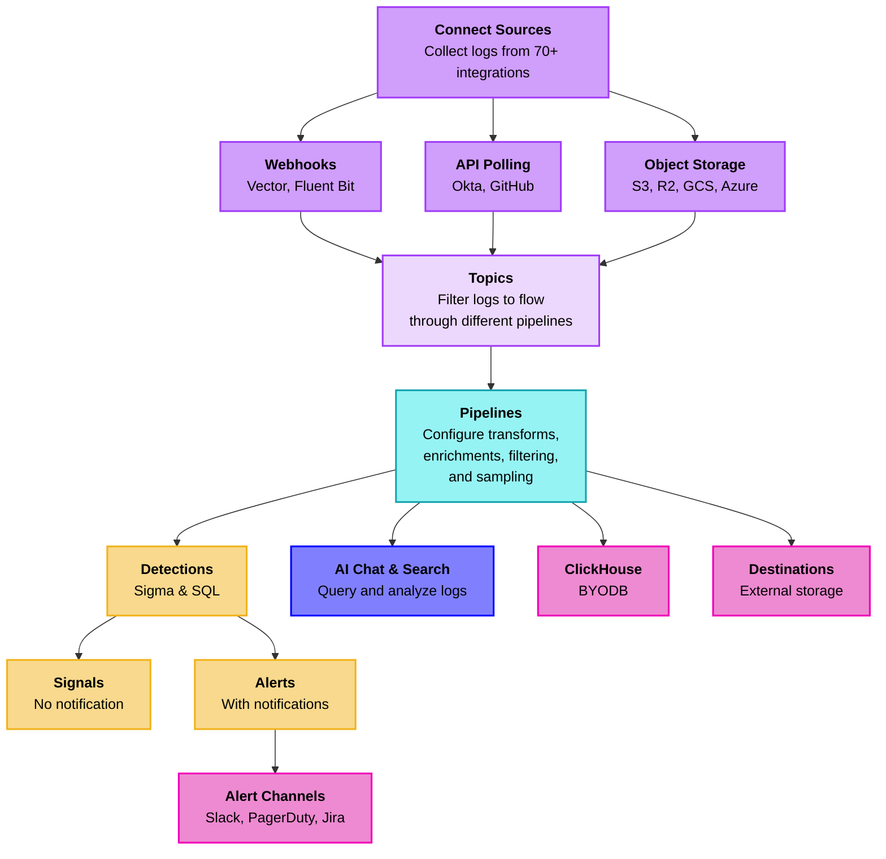

import { Callout, Steps } from 'nextra/components'

# RunReveal Onboarding Guide

RunReveal is a modern security data platform built on ClickHouse that eliminates traditional SIEM complexity while delivering detection-as-code, AI-powered investigations, and sub-second query performance at scale. This guide walks you through setting up your workspace, connecting data sources, configuring detections, and getting your team productive with RunReveal.

## How Logs Flow Through RunReveal



## Initial Setup

<Steps>

### Create Your Account

Navigate to [app.runreveal.com](https://app.runreveal.com) and create your account:

1. Click **Sign Up** and enter your email address
2. Check your email for the verification link
3. Complete account setup with your name and company information

Your workspace is automatically created with default settings:
- Workspace name: `your-email's Workspace`
- Admin role: Automatically assigned
- Default email notifications: Pre-configured

### Verify Workspace Setup

**Verify workspace configuration**:

1. Go to **Settings → Workspace Settings** in your dashboard
2. Check workspace name and admin role

Expected workspace structure:
- Admin access enabled
- Default notification channel active

**Verify notification channels**:

1. Go to **Notification Channels** in your dashboard
2. Confirm default email channel is active
3. Test notification delivery

Default email notifications include:
- Detection alerts
- System health notifications
- Source connection status

### Invite Team Members

<Callout type="info">
RunReveal supports four role types: Admin (full access), Analyst (detection management), Operator (query and reporting), and CIBot (CI/CD automation).
</Callout>

Invite team members through the dashboard:

1. Navigate to **Settings → Workspace Members**
2. Click **Invite User**
3. Enter email address and select appropriate role
4. Click **Send Invitation**

Invited users receive an email with signup instructions. You'll see their status update from "Pending" to "Active" once they accept.

**Role Capabilities**:

| Role | Detections | Sources | Workspace Settings | Query Access |
|------|-----------|---------|-------------------|--------------|
| Admin | ✓ | ✓ | ✓ | ✓ |
| Analyst | ✓ | Read-only | Read-only | ✓ |
| Operator | Read-only | Read-only | Read-only | ✓ |
| CIBot | ✓ | Read-only | Read-only | ✓ |

</Steps>

## Connect Your First Source

<Callout type="tip">
**Recommended First Sources**: Start with **Okta**, **Google Workspace**, or **AWS CloudTrail** - these provide immediate security value and are among the easiest to configure.
</Callout>

<Steps>

### Choose Your Source

RunReveal supports 70+ integrations across three primary ingestion methods:

- **API Polling**: Okta, Google Workspace, GitHub, Office 365, and more
- **Object Storage**: AWS S3, Cloudflare R2, Google Cloud Storage, Azure Blob
- **Webhooks**: Vector, Fluent Bit, custom applications, and any HTTP-based log source

### Add Your First Source

1. Navigate to **Sources** in your RunReveal dashboard: [app.runreveal.com/dash/sources](https://app.runreveal.com/dash/sources)
2. Click **Connect a new source** or **Add Source**
3. Browse available integrations or search for your specific source
4. Select your source type (e.g., Okta, Google Workspace, AWS CloudTrail)
5. Follow the setup wizard to configure your source
6. Click **Test Connection** to verify connectivity
7. Click **Save** to activate the source

<Callout type="info">
**Need detailed setup instructions?** Check out our comprehensive [Sources documentation](/sources) for step-by-step guides for each integration type.
</Callout>

### Verify Data Flow

After connecting your source, verify logs are flowing:

1. Wait 2-5 minutes for initial data ingestion
2. Navigate to **Sources → [Your Source] → Recent Events** to view live log data
3. Or run a quick query in **Explorer**:

```sql
-- Check for logs from your source
SELECT 
  sourceType,
  COUNT(*) as event_count,
  MIN(receivedAt) as first_event,
  MAX(receivedAt) as last_event
FROM logs 
WHERE sourceType = 'your-source-type'
  AND receivedAt > now() - INTERVAL 1 HOUR
GROUP BY sourceType
```

<Callout type="success">
**✓ Success!** If you see logs appearing, your source is connected and working. You're ready to create detections!
</Callout>

</Steps>

## Set Up Notification Channels

<Callout type="info">
Notification channels allow you to receive alerts when detections trigger. Set up your notification channels before creating detections so alerts are delivered immediately.
</Callout>

<Steps>

### Overview

RunReveal supports multiple notification channels to deliver alerts:
- **Email** - Pre-configured by default, sends to workspace admins
- **Slack** - Real-time alerts in Slack channels
- **PagerDuty** - Incident management and on-call integration
- **Webhook** - Custom integrations and SOAR platforms (Tines, Shuffle, etc.)
- **Jira** - Automatic ticket creation for alerts

### Add Notification Channels

1. Navigate to **Notification Channels** in your RunReveal dashboard: [app.runreveal.com/dash/notifications](https://app.runreveal.com/dash/notifications)
2. Click **Add Channel** or **Connect Channel**
3. Select your notification channel type (Slack, PagerDuty, Webhook, etc.)
4. Follow the setup wizard to configure your channel:
   - For **Slack**: Authorize and select channel
   - For **PagerDuty**: Enter Integration Key from PagerDuty
   - For **Webhook**: Enter webhook URL and configure headers
   - For **Email**: Add recipients (pre-configured by default)
5. Click **Test** to verify the channel works
6. Click **Save** to activate the channel

<Callout type="tip">
**Email is pre-configured by default** and sends alerts to workspace admins. You can customize recipients in **Notification Channels → Email Channel**.
</Callout>

<Callout type="info">
**Need detailed setup instructions?** Check out our [Notifications documentation](/notifications/getting-started) for step-by-step guides for each channel type.
</Callout>

### Subscribe Detections to Notification Channels

You can attach notification channels to detections in two ways:

**Method 1: Individual Detection**
- Edit a detection and select notification channels in the configuration

**Method 2: Bulk Subscribe (Recommended for Multiple Detections)**
1. Navigate to [Managed Detections Queries](https://app.runreveal.com/dash/managed-detections/queries)
2. Click on each detection you want to configure
3. Click **Subscribe**
4. Select one or more notification channels that have been created
5. Repeat for all detections that need alerts

<Callout type="tip">
Use the bulk subscribe method when you have multiple detections and want to quickly attach the same notification channels to all of them.
</Callout>

### Verify Notification Channels

After setting up your channels:

1. Go to **Notification Channels** dashboard
2. Verify all channels show as **Active**
3. Use the **Test** button on each channel to verify delivery
4. Check your email, Slack, or other channels to confirm test messages were received

</Steps>

## Configure Detections

<Callout type="info">
Detections continuously monitor your logs for security events. Create detections as SQL queries or Sigma rules, then configure notification channels for alerts.
</Callout>

<Steps>

### Create Your First Detection

Navigate to **Detections → Create Detection**:

**Example: Failed Login Attempts**

```yaml
name: Failed Login Attempts
description: Alert on multiple failed login attempts from same IP
severity: medium
schedule: "*/15 * * * *"  # Every 15 minutes
```

**Query**:

```sql
SELECT 
  actor.email as user,
  src.ip as source_ip,
  COUNT(*) as failed_attempts,
  MIN(receivedAt) as first_attempt,
  MAX(receivedAt) as last_attempt
FROM logs 
WHERE eventName = 'user.session.start'
  AND outcome.result = 'FAILURE'
  AND receivedAt BETWEEN {from:DateTime} AND {to:DateTime}
GROUP BY actor.email, src.ip
HAVING failed_attempts >= 5
ORDER BY failed_attempts DESC
```

### Attach Notification Channels to Detections

After creating your detection, attach notification channels to receive alerts:

1. In the detection configuration, find **Notification Channels**
2. Select one or more channels you've configured
3. Click **Save and Enable**

<Callout type="info">
**Note**: Detections without notification channels will generate **signals** (for analysis) but won't send alerts. Attach a channel to convert signals into **alerts** with notifications.
</Callout>

### Enable and Monitor Detections

After creating your detection:

1. Click **Test Detection** to verify query returns results
2. Review notification channel configuration
3. Click **Save and Enable**

Navigate to **Detections** dashboard to view:
- Active detections count
- Detection success rate
- Recent alerts generated
- Average execution time

</Steps>

## Explore Platform Features

<Steps>

### Run SQL Queries

Navigate to **Explorer** or **Search** and try these queries:

**Most Common Events (24 hours)**:

```sql
SELECT 
  eventName,
  sourceType,
  COUNT(*) as event_count,
  COUNT(DISTINCT src.ip) as unique_ips
FROM logs 
WHERE receivedAt > now() - INTERVAL 24 HOUR
GROUP BY eventName, sourceType
ORDER BY event_count DESC
LIMIT 20
```

**Top Active Users**:

```sql
SELECT 
  actor.email as user,
  COUNT(*) as total_events,
  COUNT(DISTINCT eventName) as unique_actions,
  MIN(receivedAt) as first_seen,
  MAX(receivedAt) as last_seen
FROM logs 
WHERE actor.email != ''
  AND receivedAt > now() - INTERVAL 7 DAY
GROUP BY actor.email
ORDER BY total_events DESC
LIMIT 50
```

### Use AI Chat

<Callout type="info">
AI Chat uses Claude to help you investigate security events, write queries, and analyze patterns across your logs.
</Callout>

**Enable AI Chat**:

1. Go to **Settings → AI Settings**
2. Configure AI provider (AWS Bedrock, OpenAI, or Azure OpenAI)
3. Enter your API credentials
4. Click **Test Connection** then **Save**

**Try AI Chat**:

Navigate to **Chat** and try prompts like:
- "What are the most common event types in the last 24 hours?"
- "Show me any failed login attempts from unusual locations"
- "Write a detection for AWS IAM policy changes"

### Set Up Dashboards

**Create Custom Dashboard**:

1. Go to **Dashboards → Create Dashboard**
2. Dashboard name: `Security Overview`
3. Description: `Real-time security metrics and alerts`
4. Click **Create**

**Add Dashboard Widgets**:

Available widget types include Time Series Charts, Counter Widgets, and Table Widgets. Each widget is powered by SQL queries.

**Share Dashboard**:

1. Open your dashboard
2. Click **Share** button
3. Configure access settings
4. Copy share link
5. Distribute to team members

</Steps>

## Helpful Links

Now that you have completed RunReveal onboarding, explore the detailed configuration guides:

- **[Detections](/detections)** - Create and manage security detection rules
- **[Sigma Streaming](/detections/sigma-streaming)** - Use Sigma rules for standardized threat detection
- **[Detection as Code](/detections/detection-as-code)** - Manage detections through code and version control
- **[Sources](/sources)** - Set up data collection from your systems
- **[Pipelines](/logs/log-processing/getting-started)** - Configure data processing workflows
- **[Notifications Getting Started](/notifications/getting-started)** - Set up alerting and notification channels
- **[AI Chat](/ai-chat)** - Use AI-powered analysis for threat hunting and investigation
- **[Enrichments](/logs/log-processing/enrichments)** - Add context and metadata to your security events
