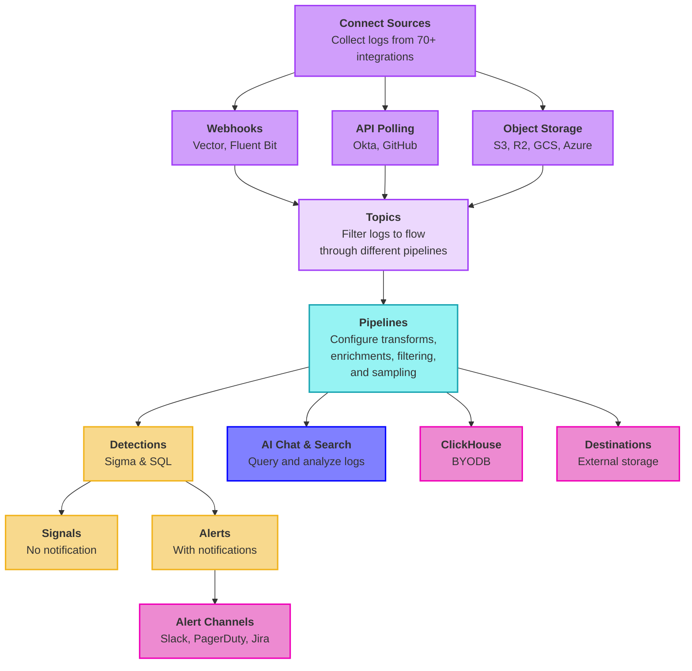

import { Callout, Steps } from 'nextra/components'

# RunReveal Onboarding Guide

RunReveal is a modern security data platform built on ClickHouse that eliminates traditional SIEM complexity while delivering detection-as-code, AI-powered investigations, and sub-second query performance at scale. This guide walks you through setting up your workspace, connecting data sources, configuring detections, and getting your team productive with RunReveal.

## How Logs Flow Through RunReveal



## Initial Setup

<Steps>

### Create Your Account

Navigate to [app.runreveal.com](https://app.runreveal.com) and create your account:

1. Click **Sign Up** and enter your email address
2. Check your email for the verification link
3. Complete account setup with your name and company information

Your workspace is automatically created with default settings:
- Workspace name: `your-email's Workspace`
- Admin role: Automatically assigned
- Default email notifications: Pre-configured

### Verify Workspace Setup

**Verify workspace configuration**:

1. Go to **Settings → Workspace Settings** in your dashboard
2. Check workspace name and admin role
3. Note your workspace ID for CLI usage (Optional)

Expected workspace structure:
- Admin access enabled
- Default notification channel active
- API tokens available under **Settings → API Tokens**

**Verify notification channels**:

1. Go to **Notification Channels** in your dashboard
2. Confirm default email channel is active
3. Test notification delivery

Default email notifications include:
- Detection alerts
- System health notifications
- Source connection status

**Generate API token for CLI access (Optional)**:

1. Go to **Settings → API Tokens**
2. Click "Create Token"
3. Name: "CLI Access"
4. Copy token for later use

Store your API token securely - you'll need it for:
- RunReveal CLI operations
- CI/CD integrations
- API-based automation

### Invite Team Members

<Callout type="info">
RunReveal supports four role types: Admin (full access), Analyst (detection management), Operator (query and reporting), and CIBot (CI/CD automation).
</Callout>

Invite team members through the dashboard:

1. Navigate to **Settings → Workspace Members**
2. Click **Invite User**
3. Enter email address and select appropriate role
4. Click **Send Invitation**

Invited users receive an email with signup instructions. You'll see their status update from "Pending" to "Active" once they accept.

**Role Capabilities**:

| Role | Detections | Sources | Workspace Settings | Query Access |
|------|-----------|---------|-------------------|--------------|
| Admin | ✓ | ✓ | ✓ | ✓ |
| Analyst | ✓ | Read-only | Read-only | ✓ |
| Operator | Read-only | Read-only | Read-only | ✓ |
| CIBot | ✓ | Read-only | Read-only | ✓ |

</Steps>

## Connect Your First Source

<Callout type="tip">
Start with Okta, AWS CloudTrail, or GitHub - these are the easiest integrations to configure and provide immediate security value.
</Callout>

<Steps>

### Choose Integration Type

RunReveal supports three primary ingestion methods:

- **API Polling**: Okta, GitHub, Office 365
- **Object Storage**: S3, R2, GCS, Azure Blob
- **Webhooks**: Vector, Fluent Bit, custom

### Configure Okta Integration

**Get Okta API Token**:

1. Log into Okta Admin Console
2. Navigate to **Security → API → Tokens**
3. Click **Create Token**
4. Name: `RunReveal Integration`
5. Copy the token (starts with `SSWS-`)

<Callout type="warning">
Store your Okta API token securely - it won't be shown again after creation.
</Callout>

**Configure in RunReveal**:

1. Go to **Sources** in your dashboard
2. Click **Add Source → Okta**
3. Enter configuration:
   - Domain: `company.okta.com`
   - API Token: Your SSWS token
   - Log Types: System logs, User events, Authentication events
4. Click **Test Connection**
5. Click **Save**

Expected result: Logs start flowing within 60-120 seconds.

**Verify Data Flow**:

```sql
-- Check for Okta logs
SELECT 
  eventName,
  COUNT(*) as event_count
FROM logs 
WHERE sourceType = 'okta'
  AND receivedAt > now() - INTERVAL 5 MINUTE
GROUP BY eventName
ORDER BY event_count DESC
```

Navigate to **Sources → Okta → Recent Events** to view live log data.

### Configure AWS CloudTrail

**Deploy CloudFormation Stack**:

1. Use RunReveal's pre-built template from the AWS Console
2. Stack name: `RunRevealSetup`
3. Parameters: Accept defaults
4. Capabilities: Acknowledge IAM resource creation
5. Wait for stack creation (2-3 minutes)

<Callout type="info">
The CloudFormation template creates an S3 bucket, enables CloudTrail logging, and configures cross-account access for RunReveal.
</Callout>

**Add Source in RunReveal**:

1. Go to **Sources → Add Source → AWS CloudTrail**
2. Enter configuration:
   - S3 Bucket: Your CloudTrail bucket name
   - Region: Your AWS region
   - Role ARN: (leave blank for CloudFormation setup)
3. Click **Save**

**Verify CloudTrail logs**:

```sql
-- Check for AWS CloudTrail events
SELECT 
  eventName,
  userIdentity.type,
  COUNT(*) as event_count
FROM logs 
WHERE sourceType = 'aws-cloudtrail'
  AND receivedAt > now() - INTERVAL 1 HOUR
GROUP BY eventName, userIdentity.type
ORDER BY event_count DESC
LIMIT 10
```

</Steps>

## Configure and Test Detections

<Callout type="info">
Detections continuously monitor your logs for security events. Create detections as SQL queries or Sigma rules, then configure notification channels for alerts. This section walks you through setting up a webhook source, sending test data, creating a detection, and viewing the results.
</Callout>

<Steps>

### Set Up Webhook Source for Testing

<Callout type="tip">
Use webhooks for custom applications, Vector, Fluent Bit, or any log source that can POST JSON via HTTP. We'll use a webhook to send test data that will trigger our detection.
</Callout>

**Create Webhook Source**:

1. Go to **Sources → Add Source → Webhook**
2. Configure webhook name and description
3. Copy your webhook URL and bearer token (if authentication is enabled)

<Callout type="warning">
Protect your webhook URL - it provides write access to your RunReveal workspace.
</Callout>

### Send Test Security Event

Send a test security event that will match a detection rule. This example simulates a suspicious login attempt:

```bash
curl -X POST \
  https://api.runreveal.com/sources/hook/YOUR_SOURCE_ID \
  -H "Content-Type: application/json" \
  -H "Authorization: Bearer YOUR_BEARER_TOKEN" \
  -d '{
    "timestamp": "'$(date -u +%Y-%m-%dT%H:%M:%SZ)'",
    "source": "test-system",
    "eventName": "suspicious_login",
    "severity": "high",
    "user": "test-user",
    "srcIP": "192.168.1.100",
    "action": "login_attempt",
    "result": "success",
    "user_agent": "curl-test",
    "metadata": {
      "login_method": "ssh",
      "session_id": "test-123"
    }
  }'
```

### Verify Log Ingestion

Check that your test log was received in the logs table:

```sql
-- Verify webhook logs were received
SELECT 
  receivedAt,
  sourceType,
  JSONExtractString(rawLog, 'eventName') as eventName,
  JSONExtractString(rawLog, 'user') as user,
  JSONExtractString(rawLog, 'srcIP') as srcIP,
  JSONExtractString(rawLog, 'severity') as severity,
  rawLog
FROM logs
WHERE sourceType = 'structured-webhook'
  AND JSONExtractString(rawLog, 'eventName') = 'suspicious_login'
  AND receivedAt > now() - INTERVAL 5 MINUTE
ORDER BY receivedAt DESC
LIMIT 10
```

**Expected Results**: You should see one or more rows with:
- `eventName`: `suspicious_login`
- `user`: `test-user`
- `srcIP`: `192.168.1.100`
- `severity`: `high`
- `rawLog`: Full JSON object with all fields

### Create Your First Detection

Navigate to **Detections → Create Detection**:

**Example: Suspicious Login Detection**

This detection will trigger on the `suspicious_login` events from your webhook source.

**Configuration**:

1. **Name**: `test-suspicious-login`
2. **Type**: **SQL**
3. **Query**:
   ```sql
   SELECT
     JSONExtractString(rawLog, 'eventName') as eventName,
     JSONExtractString(rawLog, 'user') as user,
     JSONExtractString(rawLog, 'srcIP') as srcIP,
     JSONExtractString(rawLog, 'user_agent') as user_agent,
     JSONExtractString(rawLog, 'severity') as severity,
     JSONExtractString(rawLog, 'metadata', 'login_method') as login_method,
     receivedAt
   FROM logs
   WHERE sourceType = 'structured-webhook'
     AND JSONExtractString(rawLog, 'eventName') = 'suspicious_login'
     AND JSONExtractString(rawLog, 'srcIP') = '192.168.1.100'
     AND receivedAt BETWEEN {from:DateTime} AND {to:DateTime}
   ```
4. **Schedule**: `*/5 * * * *` (every 5 minutes)
5. **Severity**: **Medium**
6. **Categories**: `["authentication", "test"]`
7. **Notification Channels**: Leave empty for now (this will create signals)

**What This Detection Does**:

- Monitors webhook logs for `suspicious_login` events
- Filters for events from the specific test IP (`192.168.1.100`)
- Extracts key fields: user, source IP, user agent, severity, and login method
- Runs every 5 minutes to check for matching events

**After Creating the Detection**:

1. Click **Test Detection** to verify the query returns your test log
2. Review the results to confirm it matches your webhook event
3. Click **Save and Enable**

### View Detection Results

After the detection runs (wait up to 5 minutes or manually trigger it), query the signals table to see the detection results:

**View Signals**:

```sql
-- View signals generated by your detection
SELECT 
  detectionName,
  severity,
  recordsReturned,
  categories,
  createdAt,
  results
FROM signals
WHERE detectionName = 'test-suspicious-login'
ORDER BY createdAt DESC
LIMIT 10
```

**What You're Querying**: The `signals` table contains detection results that don't have notification channels configured. Each row represents one execution of your detection query.

**Expected Results**: You should see one or more rows with:
- `detectionName`: `test-suspicious-login` - The name of your detection
- `recordsReturned`: `1` (or more) - Number of log entries that matched your detection query
- `severity`: `Medium` - The severity you configured for the detection
- `categories`: `['authentication', 'test']` - The categories you assigned
- `createdAt`: Timestamp when the detection query executed
- `results`: A JSON array string containing the matched log entries. Each entry includes the fields you selected in your detection query (`eventName`, `user`, `srcIP`, `user_agent`, `severity`, `login_method`, `receivedAt`)

**Example results JSON structure**:
```json
[
  {
    "eventName": "suspicious_login",
    "user": "test-user",
    "srcIP": "192.168.1.100",
    "user_agent": "curl-test",
    "severity": "high",
    "login_method": "ssh",
    "receivedAt": "2025-01-15T14:30:00Z"
  }
]
```

**View All Detection Results**:

To see all detection results (both signals and alerts), query the detections table:

```sql
-- View all detection results for your test detection
SELECT 
  detectionName,
  severity,
  recordsReturned,
  categories,
  notificationNames,
  createdAt,
  results
FROM detections
WHERE detectionName = 'test-suspicious-login'
ORDER BY createdAt DESC
LIMIT 10
```

**What You're Querying**: The `detections` table contains all detection results, regardless of notification configuration. The `notificationNames` field distinguishes signals from alerts.

**Expected Results**: Similar to the signals query, but with an additional `notificationNames` field:
- If `notificationNames` is empty (`[]`): This detection result is a **signal** (no notifications sent)
- If `notificationNames` contains values (e.g., `['email', 'slack']`): This detection result is an **alert** (notifications were sent)

Since you created the detection without notification channels, all results should show empty `notificationNames` arrays, meaning they appear in both the `detections` and `signals` tables.

### Configure Notification Channels

**Set Up Slack Integration**:

1. Go to **Notification Channels → Add Channel → Slack**
2. Click **Authorize Slack**
3. Select your Slack workspace
4. Choose channel: `#security-alerts`
5. Test notification
6. Click **Save**

**Configure Email Notifications**:

Email channel is pre-configured by default. Customize recipients:

1. Go to **Notification Channels → Email Channel**
2. Add recipients
3. Configure email format
4. Click **Save**

**Set Up PagerDuty Integration**:

1. Create PagerDuty Integration in PagerDuty console
2. Copy Integration Key
3. Go to **Notification Channels → Add Channel → PagerDuty** in RunReveal
4. Paste Integration Key
5. Configure incident severity mapping
6. Test integration

### Enable and Monitor Detections

**Monitor in Dashboard**:

Navigate to **Detections** dashboard to view:
- Active detections count
- Detection success rate
- Recent signals and alerts generated
- Average execution time

**Next Steps**:

- The detection will run automatically every 5 minutes based on the schedule
- Query the `signals` table (see queries above) to view detection results
- When ready, add notification channels to your detection to convert signals into alerts
- Edit your detection and attach notification channels to start receiving alerts

</Steps>

## Explore Platform Features

<Steps>

### Run SQL Queries

Navigate to **Explorer** or **Search** and try these queries:

**Most Common Events (24 hours)**:

```sql
SELECT 
  eventName,
  sourceType,
  COUNT(*) as event_count,
  COUNT(DISTINCT src.ip) as unique_ips
FROM logs 
WHERE receivedAt > now() - INTERVAL 24 HOUR
GROUP BY eventName, sourceType
ORDER BY event_count DESC
LIMIT 20
```

**Top Active Users**:

```sql
SELECT 
  actor.email as user,
  COUNT(*) as total_events,
  COUNT(DISTINCT eventName) as unique_actions,
  MIN(receivedAt) as first_seen,
  MAX(receivedAt) as last_seen
FROM logs 
WHERE actor.email != ''
  AND receivedAt > now() - INTERVAL 7 DAY
GROUP BY actor.email
ORDER BY total_events DESC
LIMIT 50
```

### Use AI Chat

<Callout type="info">
AI Chat uses Claude to help you investigate security events, write queries, and analyze patterns across your logs.
</Callout>

**Enable AI Chat**:

1. Go to **Settings → AI Settings**
2. Configure AI provider (AWS Bedrock, OpenAI, or Azure OpenAI)
3. Enter your API credentials
4. Click **Test Connection** then **Save**

**Try AI Chat**:

Navigate to **Chat** and try prompts like:
- "What are the most common event types in the last 24 hours?"
- "Show me any failed login attempts from unusual locations"
- "Write a detection for AWS IAM policy changes"

### Set Up Dashboards

**Create Custom Dashboard**:

1. Go to **Dashboards → Create Dashboard**
2. Dashboard name: `Security Overview`
3. Description: `Real-time security metrics and alerts`
4. Click **Create**

**Add Dashboard Widgets**:

Available widget types include Time Series Charts, Counter Widgets, and Table Widgets. Each widget is powered by SQL queries.

**Share Dashboard**:

1. Open your dashboard
2. Click **Share** button
3. Configure access settings
4. Copy share link
5. Distribute to team members

### Install RunReveal CLI (Optional)

<Callout type="tip">
The RunReveal CLI enables detection-as-code workflows, automated testing, and CI/CD integration.
</Callout>

**Install via Homebrew (macOS)**:

```bash
brew tap runreveal/runreveal
brew install runreveal
```

**Install Binary (Linux)**:

```bash
curl -L https://github.com/runreveal/runreveal/releases/latest/download/runreveal-linux-amd64 -o runreveal
chmod +x runreveal
sudo mv runreveal /usr/local/bin/
```

**Configure CLI**:

```bash
# Authenticate with API token
runreveal config set api-token YOUR_API_TOKEN

# Set default workspace
runreveal config set workspace YOUR_WORKSPACE_ID

# Verify configuration
runreveal config list
```

**Common CLI Commands**:

```bash
# List all detections
runreveal detections list

# Create new detection
runreveal detections create --file detection.yaml

# Test detection locally
runreveal detections test --name "Failed Logins"

# Export detections to YAML
runreveal detections export --output ./detections/

# View recent logs
runreveal logs query "SELECT * FROM logs LIMIT 10"
```

</Steps>

## Helpful Links

Now that you have completed RunReveal onboarding, explore the detailed configuration guides:

- **[Detections](/detections)** - Create and manage security detection rules
- **[Sigma Streaming](/detections/sigma-streaming)** - Use Sigma rules for standardized threat detection
- **[Detection as Code](/detections/detection-as-code)** - Manage detections through code and version control
- **[Sources](/sources)** - Set up data collection from your systems
- **[Pipelines](/logs/log-processing/getting-started)** - Configure data processing workflows
- **[Notifications Getting Started](/notifications/getting-started)** - Set up alerting and notification channels
- **[AI Chat](/ai-chat)** - Use AI-powered analysis for threat hunting and investigation
- **[Enrichments](/logs/log-processing/enrichments)** - Add context and metadata to your security events
