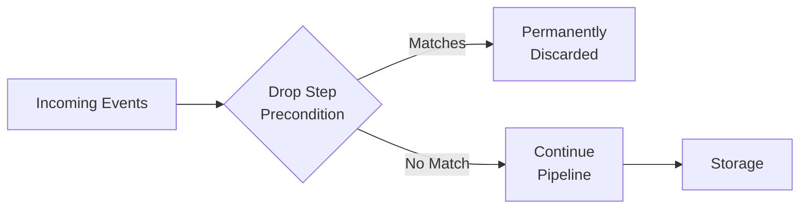

import { Callout, Tabs } from 'nextra/components'

# Dropping Logs

Drop steps permanently remove events from your pipeline before they reach storage. This is useful for eliminating noise, reducing costs, and ensuring sensitive data never enters your logs.

<Callout type="warning">
<strong>Permanent Deletion</strong>: Dropped events are permanently discarded and cannot be recovered. If you might need events for compliance or forensics, use <a href="/logs/log-processing/filtering">Filtering</a> to archive them instead.
</Callout>

## When to Use Drop

Drop is ideal for:

- **Eliminating noise** from health checks, heartbeats, and routine system operations
- **Reducing costs** by removing high-volume, zero-value events
- **Preventing PII storage** by dropping events containing sensitive data patterns
- **Simple, pipeline-specific rules** that don't need to be shared across pipelines

## How Dropping Works

When you add a Drop step to a pipeline:

1. Events matching the step's preconditions are identified
2. Matching events are permanently discarded
3. Non-matching events continue through the pipeline
4. Dropped events never reach storage or detections



## Configuration

Drop steps use preconditions to determine which events to remove:

| Precondition Type | Description | Example |
|-------------------|-------------|---------|
| **Exact Match** | Drop events with specific field values | `actor.email = "system@okta.com"` |
| **Not Equal** | Drop events that don't match a value | `environment != "production"` |
| **Regex** | Drop events matching a pattern | `eventName regex: ^Describe.*` |
| **Is Empty** | Drop events with missing fields | `actor.email isEmpty` |
| **CIDR Match** | Drop events from IP ranges | `src.ip cidrMatch: 10.0.0.0/8` |

## Use Cases

<div className="space-y-6 mt-4">

<div className="bg-white dark:bg-gray-800 rounded-2xl border border-gray-200 dark:border-gray-700 shadow-sm overflow-hidden">
  <div className="p-5">
    <h4 className="text-lg font-bold text-gray-900 dark:text-white m-0 mb-3">Drop AWS CloudTrail Read-Only API Calls</h4>
    
    <div className="text-sm text-gray-600 dark:text-gray-400 mb-4 leading-relaxed">
      AWS generates high volumes of read-only API calls (Describe*, List*, Get*) that often have limited security value. Drop these to focus on write operations and configuration changes.
    </div>

    <Tabs items={['Event to Drop', 'Drop Precondition']}>
      <Tabs.Tab>

```json
{
  "eventName": "DescribeInstances",
  "eventSource": "ec2.amazonaws.com",
  "userIdentity": {
    "arn": "arn:aws:iam::123456789012:role/monitoring-role",
    "invokedBy": "monitoring.amazonaws.com"
  },
  "readOnly": true
}
```

      </Tabs.Tab>
      <Tabs.Tab>

```text
Precondition:
  Field: readOnly (select "other")
  Type: exact
  Value: true
```

      </Tabs.Tab>
    </Tabs>

    <div className="mt-4">
      <h5 className="text-sm font-semibold text-gray-700 dark:text-gray-300 mb-2">Alternative: Drop by Event Name Pattern</h5>
      <div className="space-y-2">
        <div className="flex justify-between items-center py-2 px-3 bg-purple-50 dark:bg-purple-900/20 rounded-lg border border-purple-200 dark:border-purple-800">
          <span className="text-sm text-gray-600 dark:text-gray-400">Drop Describe/List/Get calls</span>
          <span className="text-sm font-mono text-purple-700 dark:text-purple-300">eventName regex: ^(Describe|List|Get)</span>
        </div>
      </div>
    </div>
  </div>
</div>

<div className="bg-white dark:bg-gray-800 rounded-2xl border border-gray-200 dark:border-gray-700 shadow-sm overflow-hidden">
  <div className="p-5">
    <h4 className="text-lg font-bold text-gray-900 dark:text-white m-0 mb-3">Drop AWS KMS Decrypt Noise</h4>
    
    <div className="text-sm text-gray-600 dark:text-gray-400 mb-4 leading-relaxed">
      AWS services automatically call KMS Decrypt for encrypted resources, generating thousands of routine events. Drop these internal operations while keeping user-initiated KMS activity.
    </div>

    <Tabs items={['Event to Drop', 'Drop Precondition']}>
      <Tabs.Tab>

```json
{
  "eventName": "Decrypt",
  "eventSource": "kms.amazonaws.com",
  "userIdentity": {
    "invokedBy": "AWS Internal"
  },
  "requestParameters": {
    "encryptionContext": {
      "aws:lambda:FunctionArn": "arn:aws:lambda:us-east-1:123456789012:function:myFunction"
    }
  }
}
```

      </Tabs.Tab>
      <Tabs.Tab>

```text
Precondition 1 (AND):
  Field: eventName
  Type: exact
  Value: Decrypt

Precondition 2 (AND):
  Field: userIdentity.invokedBy (select "other")
  Type: exact
  Value: AWS Internal
```

      </Tabs.Tab>
    </Tabs>

    <Callout type="info">
      Adding multiple preconditions to the same step creates an AND condition—both must match for the event to be dropped.
    </Callout>
  </div>
</div>

<div className="bg-white dark:bg-gray-800 rounded-2xl border border-gray-200 dark:border-gray-700 shadow-sm overflow-hidden">
  <div className="p-5">
    <h4 className="text-lg font-bold text-gray-900 dark:text-white m-0 mb-3">Drop Okta System Events</h4>
    
    <div className="text-sm text-gray-600 dark:text-gray-400 mb-4 leading-relaxed">
      Okta generates system-level events from the SystemPrincipal actor that are typically not relevant for security monitoring.
    </div>

    <Tabs items={['Event to Drop', 'Drop Precondition']}>
      <Tabs.Tab>

```json
{
  "eventType": "system.org.rate_limit.warning",
  "actor": {
    "id": "00u0000000000000000",
    "type": "SystemPrincipal",
    "alternateId": "system@okta.com",
    "displayName": "Okta System"
  },
  "outcome": { "result": "SUCCESS" }
}
```

      </Tabs.Tab>
      <Tabs.Tab>

```text
Precondition:
  Field: actor.alternateId (select "other")
  Type: exact
  Value: system@okta.com
```

      </Tabs.Tab>
    </Tabs>
  </div>
</div>

<div className="bg-white dark:bg-gray-800 rounded-2xl border border-gray-200 dark:border-gray-700 shadow-sm overflow-hidden">
  <div className="p-5">
    <h4 className="text-lg font-bold text-gray-900 dark:text-white m-0 mb-3">Drop Health Check Traffic</h4>
    
    <div className="text-sm text-gray-600 dark:text-gray-400 mb-4 leading-relaxed">
      Load balancer and Kubernetes health checks generate constant traffic with no security value. Drop these events to reduce noise.
    </div>

    <Tabs items={['Event to Drop', 'Drop Precondition']}>
      <Tabs.Tab>

```json
{
  "type": "h2",
  "elb": "app/my-alb/50dc6c495c0c9188",
  "request_url": "https://10.0.1.50:443/health",
  "user_agent": "ELB-HealthChecker/2.0",
  "target_status_code": 200
}
```

      </Tabs.Tab>
      <Tabs.Tab>

```text
Precondition:
  Field: user_agent (select "other")
  Type: regex
  Value: ^(ELB-HealthChecker|kube-probe)
```

      </Tabs.Tab>
    </Tabs>
  </div>
</div>

<div className="bg-white dark:bg-gray-800 rounded-2xl border border-gray-200 dark:border-gray-700 shadow-sm overflow-hidden">
  <div className="p-5">
    <h4 className="text-lg font-bold text-gray-900 dark:text-white m-0 mb-3">Drop Events with Incomplete Data</h4>
    
    <div className="text-sm text-gray-600 dark:text-gray-400 mb-4 leading-relaxed">
      Events missing critical fields (like actor information) may not be useful for security analysis. Drop events with empty required fields.
    </div>

    <Tabs items={['Event to Drop', 'Drop Precondition']}>
      <Tabs.Tab>

```json
{
  "eventName": "anonymous_request",
  "actor": {},
  "src": { "ip": "10.0.0.1" }
}
```

      </Tabs.Tab>
      <Tabs.Tab>

```text
Precondition:
  Field: actor.email
  Type: isEmpty
```

      </Tabs.Tab>
    </Tabs>
  </div>
</div>

</div>

## Drop vs Filter vs Sample

| Action | Data Retained | Use Case |
|--------|---------------|----------|
| **Drop** | ❌ Permanently deleted | Zero-value events you never need |
| **[Filter](/logs/log-processing/filtering)** | ✅ Archived (searchable) | Low-value events you might need for compliance |
| **[Sample](/logs/log-processing/sampling)** | ✅ Percentage kept | High-volume events where statistical patterns suffice |

## Best Practices

1. **Start with Filter, not Drop**: Archive events first to validate your rules don't catch important data
2. **Use specific preconditions**: Avoid overly broad patterns that might drop security-relevant events
3. **Combine with enrichments**: Tag events for dropping using [enrichments](/logs/log-processing/enrichments) to centralize your drop logic
4. **Document your drops**: Keep a record of what you're dropping and why
5. **Monitor for gaps**: Periodically review if dropped event types become relevant

## Using Enrichments with Drop Steps

For complex drop logic or centralized management, use [enrichments](/logs/log-processing/enrichments) to tag events, then drop based on the enrichment flag:

<div className="bg-white dark:bg-gray-800 rounded-2xl border border-gray-200 dark:border-gray-700 shadow-sm overflow-hidden my-6">
  <div className="p-5">
    <h4 className="text-lg font-bold text-gray-900 dark:text-white m-0 mb-3">Enrichment-Based Dropping</h4>
    
    <div className="space-y-4 mb-4">
      <div>
        <h5 className="text-sm font-semibold text-gray-700 dark:text-gray-300 mb-2">Step 1: Create Enrichment</h5>
        <div className="text-sm text-gray-600 dark:text-gray-400 pl-4 border-l-2 border-purple-300 dark:border-purple-700">
          Create an enrichment named <code>drop-candidates</code> that tags events with <code>{"{"}"should_drop": true{"}"}</code>
        </div>
      </div>
      <div>
        <h5 className="text-sm font-semibold text-gray-700 dark:text-gray-300 mb-2">Step 2: Add Enrich Step</h5>
        <div className="text-sm text-gray-600 dark:text-gray-400 pl-4 border-l-2 border-purple-300 dark:border-purple-700">
          Add an <strong>Enrich</strong> step to your pipeline that applies the <code>drop-candidates</code> enrichment
        </div>
      </div>
      <div>
        <h5 className="text-sm font-semibold text-gray-700 dark:text-gray-300 mb-2">Step 3: Add Drop Step</h5>
        <div className="text-sm text-gray-600 dark:text-gray-400 pl-4 border-l-2 border-purple-300 dark:border-purple-700">
          Add a <strong>Drop</strong> step with precondition: <code>enrichments</code> contains <code>"should_drop": true</code>
        </div>
      </div>
    </div>

    <Callout type="info">
      This pattern centralizes your drop rules in enrichments, making them easier to manage and audit.
    </Callout>
  </div>
</div>

