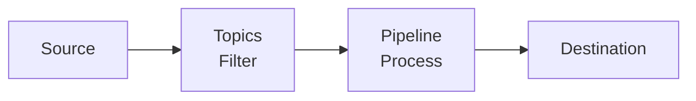

import { Image, Callout, Tabs, Steps } from 'nextra/components'

# Pipelines

Pipelines provide fine-grained control over log event processing. They consist of **topics** (which filter events) and **pipelines** (which process the filtered events through a series of steps). By mixing and rearranging pipeline steps, you can control how your events are transformed before being sent to their destinations.

<Callout type="info">
<strong>Getting Started</strong>: Navigate to <strong>Pipelines</strong> in RunReveal to create your first topic and pipeline, or manage existing ones.
</Callout>

## Pipeline Architecture



### Event Flow
1. **Events arrive** from your configured sources
2. **Topics filter** events based on preconditions
3. **Pipelines process** filtered events through steps
4. **Events are sent** to their final destinations

## Topics: Event Filtering

Topics apply filters to select subsets of events before they enter a pipeline. They use preconditions to determine which events get routed to specific pipelines.

### Topic Preconditions
Topics use preconditions to determine which events get routed to specific pipelines:

- **Source-based**: Route events from specific sources (e.g., `webhook` sources)
- **Field-based**: Route events based on field values
- **Custom criteria**: Any combination of filtering conditions

### Managing Topics

To manage your topics, navigate to the [Pipelines Page](https://app.runreveal.com/dash/pipelines).


**Topic Evaluation Order:**
- Events are evaluated against topics **from top to bottom**
- Events that don't match any custom topics go to the **default RunReveal pipeline**
- Topics can be reordered by dragging them up/down in the list

### Creating a Topic

<Steps>

### Start Topic Creation

Click the **"Create Topic"** button to open the topic creation wizard.


### Configure Topic Details

Each topic needs a name and a precondition. The precondition determines which subset of events will be routed to your topic.


**Example**: The precondition above matches any events coming from `webhook` sources.

### Choose Pipeline Configuration

Configure where your matching events will be processed:


**Options:**
- **Use an existing pipeline**: Reuse pipelines across multiple topics
- **Create a new pipeline**: Start with a fresh pipeline from scratch
- **Copy from an existing pipeline**: Build on top of existing processing

### Configure Pipeline Steps

You're brought to the pipeline editor to configure how events are processed.


Click **Complete** to finish the wizard and set up your new resources.

</Steps>

## Pipelines: Event Processing

Pipelines detail how events are processed before being sent to their final destinations. They consist of steps that are evaluated **in order from top to bottom**. Each step includes a function to apply and a precondition to select which events the step applies to.


### Creating a Pipeline

<Steps>

### Access Pipeline Editor
Click **"Add Pipeline"** or edit an existing pipeline to open the pipeline editor.


### Build Your Pipeline
1. **Left column**: Your pipeline steps
2. **Right column**: Available steps to add
3. **Drag and drop**: Add steps from right to left column
4. **Reorder**: Drag steps up/down to change evaluation order

### Configure Step Preconditions
Each step can have preconditions to determine which events it applies to.

</Steps>

<Callout type="warning">
<strong>Shared Pipeline Warning</strong>: When editing a pipeline shared between multiple topics, you'll be prompted to unlock it first. Changes affect all matching topics - proceed with caution.
</Callout>

## Processing Steps

Pipeline steps are executed in order from top to bottom. Each step can have preconditions to determine which events it applies to.

| Step | Purpose | When to Use |
|------|---------|-------------|
| **[Transform](/logs/log-processing/transforms)** | Modify event data structure and content | • Standardizing data from different sources<br/>• Cleaning up field names<br/>• Restructuring JSON |
| **[Enrich](/logs/log-processing/enrichments)** | Add additional context to events | • Enhancing events with contextual information for better analysis |
| **[Filter](/logs/log-processing/filtering)** | Apply reusable filter rules | • When you need reusable, configurable filtering rules that can be shared across pipelines<br/>• When you want to archive events instead of dropping them |
| **[Detect](/detections/sigma-streaming)** | Run streaming detections (Sigma rules) on events as they are ingested | • Real-time threat detection as events are ingested |
| **[Sample](/logs/log-processing/sampling)** | Reduce event volume by sampling a percentage | • Cost optimization for noisy sources<br/>• Performance tuning |
| **[Drop](/logs/log-processing/dropping)** | Remove events from processing | • Simple, pipeline-specific event dropping that doesn't require reusable filter rules |

## Precondition Types

Preconditions are used by topics and pipeline steps to determine which events they apply to. All preconditions use the same matching logic.

<Tabs items={['Exact Match', 'Not Equal', 'Regex', 'Is Empty', 'CIDR Match']} defaultIndex="0">

<Tabs.Tab>

### Exact Match
Match exact string values.

**Example:**
- **Field**: `normalized.actor.email`
- **Type**: `exact`
- **Value**: `admin@company.com`

</Tabs.Tab>

<Tabs.Tab>

### Not Equal
Exclude specific values.

**Example:**
- **Field**: `normalized.service.name`
- **Type**: `notEqual`
- **Value**: `health-check`

</Tabs.Tab>

<Tabs.Tab>

### Regex
Pattern matching in log content using **RE2 syntax** (Go's regexp package).

**Example:**
- **Field**: Select `other`, then enter the field path (e.g., `Namespace` or `request.namespace`)
- **Type**: `regex`
- **Value**: `"app_name","value":"Material Security"`

**Note**: When targeting fields in rawLog or custom GJSON paths, select `other` as the field type, then enter the field path directly (e.g., `Namespace` for a top-level field, or `request.namespace` for nested fields).

<Callout type="info">
**Testing Your Regex**: RunReveal uses [RE2 syntax](https://github.com/google/re2/wiki/Syntax) (Go's regexp). Test your patterns at [regex101.com](https://regex101.com/?flavor=golang) - select **Golang** as the flavor. Note: RE2 does not support lookaheads, lookbehinds, or backreferences.
</Callout>

**Common RE2 Patterns:**
| Pattern | Description | Example Match |
|---------|-------------|---------------|
| `^prefix` | Starts with | `^admin` matches "admin@company.com" |
| `suffix$` | Ends with | `\.com$` matches "user@company.com" |
| `word1\|word2` | Either/or | `error\|warning` matches both |
| `\d{3}-\d{4}` | Digit patterns | Matches "555-1234" |
| `[^@]+@` | Until character | Extracts username from email |
| `(?i)pattern` | Case insensitive | `(?i)admin` matches "Admin", "ADMIN" |

</Tabs.Tab>

<Tabs.Tab>

### Is Empty
Find events with missing data.

**Example:**
- **Field**: `normalized.src.ip`
- **Type**: `isEmpty`

</Tabs.Tab>

<Tabs.Tab>

### CIDR Match
Network-based filtering using CIDR notation.

**Example:**
- **Field**: `normalized.src.ip`
- **Type**: `cidrMatch`
- **Value**: `10.0.0.0/8`

</Tabs.Tab>

</Tabs>

### Field Targeting

**Standard Fields**: Select from the dropdown for normalized (parsed) fields (e.g., `normalized.actor.email`, `normalized.src.ip`, `normalized.eventName`).

**Custom Fields**: If a field is not a normalized field, you can target it in the 'rawLog' by selecting `other` as the field type, then entering the field path directly:
- Top-level fields: Enter the field name (e.g., `Namespace`)
- Nested fields: Enter the GJSON path (e.g., `request.namespace` or `events.0.parameters.#(name="client_id").value`)

<Callout type="warning">
<strong>Google Workspace Integration</strong>: Processes logs through Google Admin SDK, which changes the JSON structure of rawLog. Use GJSON paths or regex on rawLog for reliable targeting. Field paths may not match original audit log structure.
</Callout>

## Use Cases and Examples

Explore real-world scenarios for each pipeline step. Select a step type to see relevant examples with precondition configurations.

<Callout type="info">
<strong>Combining Preconditions</strong>: Add multiple preconditions to the same step to create AND conditions (all must match). Add multiple steps of the same pipeline step type to create OR conditions (any can match).
</Callout>

<div className="bg-white dark:bg-gray-800 rounded-xl border border-gray-200 dark:border-gray-700 p-4 my-4">
  <h4 className="text-sm font-semibold text-gray-700 dark:text-gray-300 mb-3">Example: AND vs OR Logic</h4>
  <div className="grid grid-cols-1 md:grid-cols-2 gap-4">
    <div className="bg-green-50 dark:bg-green-900/20 rounded-lg p-3 border border-green-200 dark:border-green-800">
      <div className="text-xs font-semibold text-green-700 dark:text-green-300 mb-2">AND Condition (Single Step)</div>
      <div className="text-sm text-gray-600 dark:text-gray-400">
        Drop events where actor.email = <code className="text-xs">admin@company.com</code> AND src.ip = <code className="text-xs">10.0.0.0/8</code>
      </div>
      <div className="text-xs text-green-600 dark:text-green-400 mt-2">Both conditions must be true</div>
    </div>
    <div className="bg-blue-50 dark:bg-blue-900/20 rounded-lg p-3 border border-blue-200 dark:border-blue-800">
      <div className="text-xs font-semibold text-blue-700 dark:text-blue-300 mb-2">OR Condition (Multiple Steps)</div>
      <div className="text-sm text-gray-600 dark:text-gray-400">
        Step 1: Drop where actor.email = <code className="text-xs">admin@company.com</code><br/>
        Step 2: Drop where src.ip = <code className="text-xs">10.0.0.0/8</code>
      </div>
      <div className="text-xs text-blue-600 dark:text-blue-400 mt-2">Either condition triggers the action</div>
    </div>
  </div>
</div>

<Tabs items={['Transform', 'Enrich', 'Filter', 'Detect', 'Sample', 'Drop']} defaultIndex="0">

<Tabs.Tab>

### Transform Examples

Transform steps modify event data structure and content, mapping fields to RunReveal's normalized schema.

<div className="space-y-6 mt-4">

<div className="bg-white dark:bg-gray-800 rounded-2xl border border-gray-200 dark:border-gray-700 shadow-sm overflow-hidden">
  <div className="p-5">
    <h4 className="text-lg font-bold text-gray-900 dark:text-white m-0 mb-3">Normalizing Custom Webhook Data</h4>
    
    <div className="text-sm text-gray-600 dark:text-gray-400 mb-4 leading-relaxed">
      Your custom application sends webhook events with non-standard field names. Use a Transform step to extract fields and map them to RunReveal's normalized schema for consistent querying and detection.
    </div>

    <Tabs items={['Raw Input', 'Normalized Output']}>
      <Tabs.Tab>

```json
{
  "app_timestamp": "2024-01-15T10:30:00Z",
  "user_info": {
    "email_addr": "alice@company.com",
    "user_id": "usr_12345"
  },
  "event_type": "file_download",
  "client_ip": "192.168.1.100"
}
```

      </Tabs.Tab>
      <Tabs.Tab>

```json
{
  "eventTime": "2024-01-15T10:30:00Z",
  "actor": {
    "email": "alice@company.com",
    "id": "usr_12345"
  },
  "eventName": "file_download",
  "src": { "ip": "192.168.1.100" }
}
```

      </Tabs.Tab>
    </Tabs>

    <div className="mt-4">
      <h5 className="text-sm font-semibold text-gray-700 dark:text-gray-300 mb-2">Transform Configuration</h5>
      <div className="space-y-2">
        <div className="flex justify-between items-center py-2 px-3 bg-gray-50 dark:bg-gray-700/50 rounded-lg">
          <span className="text-sm text-gray-600 dark:text-gray-400">Extract JSON Field</span>
          <span className="text-sm font-mono text-gray-900 dark:text-white">user_info.email_addr → actor.email</span>
        </div>
        <div className="flex justify-between items-center py-2 px-3 bg-gray-50 dark:bg-gray-700/50 rounded-lg">
          <span className="text-sm text-gray-600 dark:text-gray-400">Extract JSON Field</span>
          <span className="text-sm font-mono text-gray-900 dark:text-white">client_ip → src.ip</span>
        </div>
        <div className="flex justify-between items-center py-2 px-3 bg-gray-50 dark:bg-gray-700/50 rounded-lg">
          <span className="text-sm text-gray-600 dark:text-gray-400">Format Date/Time</span>
          <span className="text-sm font-mono text-gray-900 dark:text-white">app_timestamp → eventTime (RFC3339)</span>
        </div>
      </div>
    </div>

    <div className="mt-4">
      <h5 className="text-sm font-semibold text-gray-700 dark:text-gray-300 mb-2">Precondition: Exact Match</h5>
      <div className="space-y-2">
        <div className="flex justify-between items-center py-2 px-3 bg-purple-50 dark:bg-purple-900/20 rounded-lg border border-purple-200 dark:border-purple-800">
          <span className="text-sm text-gray-600 dark:text-gray-400">Apply only to webhook sources</span>
          <span className="text-sm font-mono text-purple-700 dark:text-purple-300">sourceType exact: "webhook"</span>
        </div>
      </div>
    </div>
    
    <div className="mt-4 pt-3 border-t border-gray-200 dark:border-gray-700">
      <a href="/logs/log-processing/transforms" className="text-sm font-medium text-purple-600 dark:text-purple-400 hover:underline">Learn more about Transforms →</a>
    </div>
  </div>
</div>

<div className="bg-white dark:bg-gray-800 rounded-2xl border border-gray-200 dark:border-gray-700 shadow-sm overflow-hidden">
  <div className="p-5">
    <h4 className="text-lg font-bold text-gray-900 dark:text-white m-0 mb-3">Extract GitHub Webhook Actor Details</h4>
    
    <div className="text-sm text-gray-600 dark:text-gray-400 mb-4 leading-relaxed">
      GitHub webhooks nest user information deeply in the payload. Extract and normalize actor details to the standard schema for consistent querying across all sources.
    </div>

    <Tabs items={['Raw Input', 'Normalized Output']}>
      <Tabs.Tab>

```json
{
  "action": "created",
  "sender": {
    "login": "octocat",
    "id": 583231,
    "type": "User"
  },
  "repository": {
    "full_name": "octocat/Hello-World",
    "private": false
  },
  "organization": {
    "login": "github"
  }
}
```

      </Tabs.Tab>
      <Tabs.Tab>

```json
{
  "eventName": "created",
  "actor": {
    "username": "octocat",
    "id": "583231"
  },
  "resource": {
    "name": "octocat/Hello-World",
    "type": "repository"
  },
  "organization": { "name": "github" }
}
```

      </Tabs.Tab>
    </Tabs>

    <div className="mt-4">
      <h5 className="text-sm font-semibold text-gray-700 dark:text-gray-300 mb-2">Transform Configuration</h5>
      <div className="space-y-2">
        <div className="flex justify-between items-center py-2 px-3 bg-gray-50 dark:bg-gray-700/50 rounded-lg">
          <span className="text-sm text-gray-600 dark:text-gray-400">Extract JSON Field</span>
          <span className="text-sm font-mono text-gray-900 dark:text-white">sender.login → actor.username</span>
        </div>
        <div className="flex justify-between items-center py-2 px-3 bg-gray-50 dark:bg-gray-700/50 rounded-lg">
          <span className="text-sm text-gray-600 dark:text-gray-400">Extract JSON Field</span>
          <span className="text-sm font-mono text-gray-900 dark:text-white">repository.full_name → resource.name</span>
        </div>
      </div>
    </div>

    <div className="mt-4">
      <h5 className="text-sm font-semibold text-gray-700 dark:text-gray-300 mb-2">Precondition: Not Equal</h5>
      <div className="space-y-2">
        <div className="flex justify-between items-center py-2 px-3 bg-purple-50 dark:bg-purple-900/20 rounded-lg border border-purple-200 dark:border-purple-800">
          <span className="text-sm text-gray-600 dark:text-gray-400">Skip bot-generated events</span>
          <span className="text-sm font-mono text-purple-700 dark:text-purple-300">sender.type notEqual: "Bot"</span>
        </div>
      </div>
    </div>
  </div>
</div>

</div>

</Tabs.Tab>

<Tabs.Tab>

### Enrich Examples

Enrich steps add additional context to events based on pattern matching against lookup tables. Enrichments can run on all logs in a topic or be scoped with preconditions.

<div className="space-y-6 mt-4">

<div className="bg-white dark:bg-gray-800 rounded-2xl border border-gray-200 dark:border-gray-700 shadow-sm overflow-hidden">
  <div className="p-5">
    <h4 className="text-lg font-bold text-gray-900 dark:text-white m-0 mb-3">Creating a Custom Enrichment</h4>
    
    <div className="text-sm text-gray-600 dark:text-gray-400 mb-4 leading-relaxed">
      Create a reusable enrichment that adds employee metadata to events. This enrichment can then be attached to any pipeline to run on all matching logs.
    </div>

    <div className="space-y-4 mb-4">
      <div>
        <h5 className="text-sm font-semibold text-gray-700 dark:text-gray-300 mb-2">Step 1: Create the Enrichment</h5>
        <div className="text-sm text-gray-600 dark:text-gray-400 pl-4 border-l-2 border-purple-300 dark:border-purple-700">
          Navigate to <strong>Enrichments</strong> → Click <strong>Create Enrichment</strong> → Enter a <strong>Name</strong> (e.g., <code>employee-directory</code>) → Set the <strong>Match Field</strong> to <code>actor.email</code>
        </div>
      </div>
      <div>
        <h5 className="text-sm font-semibold text-gray-700 dark:text-gray-300 mb-2">Step 2: Add Enrichment Rules</h5>
        <div className="text-sm text-gray-600 dark:text-gray-400 pl-4 border-l-2 border-purple-300 dark:border-purple-700">
          Click <strong>Add Rule</strong> → Set <strong>Match Type</strong> to <code>exact</code> → Enter the <strong>Pattern</strong> (e.g., <code>bob@company.com</code>) → Add <strong>Data</strong> as JSON
        </div>
      </div>
      <div>
        <h5 className="text-sm font-semibold text-gray-700 dark:text-gray-300 mb-2">Step 3: Attach to Pipeline</h5>
        <div className="text-sm text-gray-600 dark:text-gray-400 pl-4 border-l-2 border-purple-300 dark:border-purple-700">
          Go to <strong>Pipelines</strong> → Edit your pipeline → Add an <strong>Enrich</strong> step → Select your <code>employee-directory</code> enrichment
        </div>
      </div>
    </div>

    <Tabs items={['Before Enrichment', 'After Enrichment']}>
      <Tabs.Tab>

```json
{
  "eventName": "login",
  "actor": { "email": "bob@company.com" },
  "src": { "ip": "10.0.1.50" }
}
```

      </Tabs.Tab>
      <Tabs.Tab>

```json
{
  "eventName": "login",
  "actor": { "email": "bob@company.com" },
  "src": { "ip": "10.0.1.50" },
  "enrichments": [{
    "name": "actor.email",
    "provider": "employee-directory",
    "data": {
      "department": "Engineering",
      "manager": "carol@company.com",
      "location": "SF"
    }
  }]
}
```

      </Tabs.Tab>
    </Tabs>

    <div className="mt-4">
      <h5 className="text-sm font-semibold text-gray-700 dark:text-gray-300 mb-2">Precondition: Regex</h5>
      <div className="space-y-2">
        <div className="flex justify-between items-center py-2 px-3 bg-purple-50 dark:bg-purple-900/20 rounded-lg border border-purple-200 dark:border-purple-800">
          <span className="text-sm text-gray-600 dark:text-gray-400">Only enrich corporate emails</span>
          <span className="text-sm font-mono text-purple-700 dark:text-purple-300">actor.email regex: @company\.com$</span>
        </div>
      </div>
    </div>
    
    <div className="mt-4 pt-3 border-t border-gray-200 dark:border-gray-700">
      <a href="/logs/log-processing/enrichments" className="text-sm font-medium text-purple-600 dark:text-purple-400 hover:underline">Learn more about Enrichments →</a>
    </div>
  </div>
</div>

<div className="bg-white dark:bg-gray-800 rounded-2xl border border-gray-200 dark:border-gray-700 shadow-sm overflow-hidden">
  <div className="p-5">
    <h4 className="text-lg font-bold text-gray-900 dark:text-white m-0 mb-3">Tag Events for Downstream Processing</h4>
    
    <div className="text-sm text-gray-600 dark:text-gray-400 mb-4 leading-relaxed">
      Add metadata tags to events based on IP ranges. This enrichment tags all internal traffic, which can be used for filtering, dashboards, or detection logic.
    </div>

    <div className="space-y-4 mb-4">
      <div>
        <h5 className="text-sm font-semibold text-gray-700 dark:text-gray-300 mb-2">Step 1: Create the Enrichment</h5>
        <div className="text-sm text-gray-600 dark:text-gray-400 pl-4 border-l-2 border-purple-300 dark:border-purple-700">
          Navigate to <strong>Enrichments</strong> → Click <strong>Create Enrichment</strong> → Name it <code>network-classification</code> → Set <strong>Match Field</strong> to <code>src.ip</code>
        </div>
      </div>
      <div>
        <h5 className="text-sm font-semibold text-gray-700 dark:text-gray-300 mb-2">Step 2: Add Classification Rules</h5>
        <div className="text-sm text-gray-600 dark:text-gray-400 pl-4 border-l-2 border-purple-300 dark:border-purple-700 space-y-2">
          <div><strong>Rule 1</strong>: Match Type: <code>cidr</code>, Pattern: <code>10.0.0.0/8</code>, Data: <code>{"{"}"network": "internal", "zone": "corporate"{"}"}</code></div>
          <div><strong>Rule 2</strong>: Match Type: <code>cidr</code>, Pattern: <code>192.168.0.0/16</code>, Data: <code>{"{"}"network": "internal", "zone": "vpn"{"}"}</code></div>
        </div>
      </div>
      <div>
        <h5 className="text-sm font-semibold text-gray-700 dark:text-gray-300 mb-2">Step 3: Attach to Pipeline</h5>
        <div className="text-sm text-gray-600 dark:text-gray-400 pl-4 border-l-2 border-purple-300 dark:border-purple-700">
          Go to <strong>Pipelines</strong> → Edit your pipeline → Add an <strong>Enrich</strong> step → Select <code>network-classification</code>
        </div>
      </div>
    </div>

    <Tabs items={['Before Enrichment', 'After Enrichment']}>
      <Tabs.Tab>

```json
{
  "eventName": "login",
  "actor": { "email": "alice@company.com" },
  "src": { "ip": "10.50.25.100" }
}
```

      </Tabs.Tab>
      <Tabs.Tab>

```json
{
  "eventName": "login",
  "actor": { "email": "alice@company.com" },
  "src": { "ip": "10.50.25.100" },
  "enrichments": [{
    "name": "src.ip",
    "provider": "network-classification",
    "data": {
      "network": "internal",
      "zone": "corporate"
    }
  }]
}
```

      </Tabs.Tab>
    </Tabs>

    <div className="mt-4">
      <h5 className="text-sm font-semibold text-gray-700 dark:text-gray-300 mb-2">Precondition: CIDR Match</h5>
      <div className="space-y-2">
        <div className="flex justify-between items-center py-2 px-3 bg-purple-50 dark:bg-purple-900/20 rounded-lg border border-purple-200 dark:border-purple-800">
          <span className="text-sm text-gray-600 dark:text-gray-400">Only enrich RFC1918 addresses</span>
          <span className="text-sm font-mono text-purple-700 dark:text-purple-300">src.ip cidrMatch: 10.0.0.0/8</span>
        </div>
      </div>
    </div>
  </div>
</div>

</div>

</Tabs.Tab>

<Tabs.Tab>

### Filter Examples

Filter steps apply reusable rules that can archive or route events. Unlike Drop, filters can be shared across pipelines.

<div className="space-y-6 mt-4">

<div className="bg-white dark:bg-gray-800 rounded-2xl border border-gray-200 dark:border-gray-700 shadow-sm overflow-hidden">
  <div className="p-5">
    <h4 className="text-lg font-bold text-gray-900 dark:text-white m-0 mb-3">Archive AWS ELB Health Checks</h4>
    
    <div className="text-sm text-gray-600 dark:text-gray-400 mb-4 leading-relaxed">
      AWS Elastic Load Balancer health checks generate thousands of events per hour with low security value. Archive these events (keeping them searchable if needed) while reducing noise.
    </div>

    <Tabs items={['Event Example', 'Filter Pattern']}>
      <Tabs.Tab>

```json
{
  "type": "h2",
  "elb": "app/my-alb/50dc6c495c0c9188",
  "request_url": "https://10.0.1.50:443/health",
  "user_agent": "ELB-HealthChecker/2.0",
  "target_status_code": 200,
  "request": "GET https://10.0.1.50:443/health HTTP/2.0"
}
```

      </Tabs.Tab>
      <Tabs.Tab>

```text
Pattern: ELB-HealthChecker
Field: user_agent
Action: Archive (not Drop)
```

      </Tabs.Tab>
    </Tabs>

    <div className="mt-4">
      <h5 className="text-sm font-semibold text-gray-700 dark:text-gray-300 mb-2">Filter Configuration</h5>
      <div className="space-y-2">
        <div className="flex justify-between items-center py-2 px-3 bg-gray-50 dark:bg-gray-700/50 rounded-lg">
          <span className="text-sm text-gray-600 dark:text-gray-400">Pattern</span>
          <span className="text-sm font-mono text-gray-900 dark:text-white">ELB-HealthChecker</span>
        </div>
        <div className="flex justify-between items-center py-2 px-3 bg-gray-50 dark:bg-gray-700/50 rounded-lg">
          <span className="text-sm text-gray-600 dark:text-gray-400">Reusable</span>
          <span className="text-sm font-mono text-gray-900 dark:text-white">Yes - shared across pipelines</span>
        </div>
      </div>
    </div>

    <div className="mt-4">
      <h5 className="text-sm font-semibold text-gray-700 dark:text-gray-300 mb-2">Precondition: Regex</h5>
      <div className="space-y-2">
        <div className="flex justify-between items-center py-2 px-3 bg-purple-50 dark:bg-purple-900/20 rounded-lg border border-purple-200 dark:border-purple-800">
          <span className="text-sm text-gray-600 dark:text-gray-400">Match health checker user agents</span>
          <span className="text-sm font-mono text-purple-700 dark:text-purple-300">user_agent regex: ^ELB-HealthChecker</span>
        </div>
      </div>
    </div>
    
    <div className="mt-4 pt-3 border-t border-gray-200 dark:border-gray-700">
      <a href="/logs/log-processing/filtering" className="text-sm font-medium text-purple-600 dark:text-purple-400 hover:underline">Learn more about Filtering →</a>
    </div>
  </div>
</div>

<div className="bg-white dark:bg-gray-800 rounded-2xl border border-gray-200 dark:border-gray-700 shadow-sm overflow-hidden">
  <div className="p-5">
    <h4 className="text-lg font-bold text-gray-900 dark:text-white m-0 mb-3">Archive Google Workspace Token Refresh Events</h4>
    
    <div className="text-sm text-gray-600 dark:text-gray-400 mb-4 leading-relaxed">
      OAuth token refresh events occur frequently and are typically low-value for security analysis. Archive these for compliance while keeping your main logs focused.
    </div>

    <Tabs items={['Event Example', 'Filter Pattern']}>
      <Tabs.Tab>

```json
{
  "id": { "applicationName": "token" },
  "events": [{
    "type": "auth",
    "name": "authorize"
  }],
  "actor": { "email": "user@company.com" }
}
```

      </Tabs.Tab>
      <Tabs.Tab>

```text
Field: id.applicationName (select "other")
Type: exact
Value: token
```

      </Tabs.Tab>
    </Tabs>

    <div className="mt-4">
      <h5 className="text-sm font-semibold text-gray-700 dark:text-gray-300 mb-2">Precondition: Not Equal</h5>
      <div className="space-y-2">
        <div className="flex justify-between items-center py-2 px-3 bg-purple-50 dark:bg-purple-900/20 rounded-lg border border-purple-200 dark:border-purple-800">
          <span className="text-sm text-gray-600 dark:text-gray-400">Archive token events, not admin events</span>
          <span className="text-sm font-mono text-purple-700 dark:text-purple-300">id.applicationName notEqual: "admin"</span>
        </div>
      </div>
    </div>
  </div>
</div>

</div>

</Tabs.Tab>

<Tabs.Tab>

### Detect Examples

Detect steps run Sigma rules in real-time as events are ingested, enabling immediate alerting.

<div className="space-y-6 mt-4">

<div className="bg-white dark:bg-gray-800 rounded-2xl border border-gray-200 dark:border-gray-700 shadow-sm overflow-hidden">
  <div className="p-5">
    <h4 className="text-lg font-bold text-gray-900 dark:text-white m-0 mb-3">Real-Time SSH Brute Force Detection</h4>
    
    <div className="text-sm text-gray-600 dark:text-gray-400 mb-4 leading-relaxed">
      Run Sigma rules in real-time as events are ingested. This example detects SSH authentication failures, triggering an alert immediately rather than waiting for scheduled detection queries.
    </div>

    <Tabs items={['Matching Event', 'Sigma Rule']}>
      <Tabs.Tab>

```json
{
  "eventName": "ssh_auth_failure",
  "actor": { "username": "root" },
  "src": { "ip": "203.0.113.50" },
  "service": { "name": "sshd" },
  "outcome": { "result": "FAILURE" }
}
```

      </Tabs.Tab>
      <Tabs.Tab>

```yaml
title: SSH Authentication Failure
description: Detects failed SSH login attempts
level: medium
logsource:
  product: linux
  service: sshd
detection:
  selection:
    eventName: ssh_auth_failure
    outcome.result: FAILURE
  condition: selection
notificationnames:
  - slack-security
```

      </Tabs.Tab>
    </Tabs>

    <div className="mt-4">
      <h5 className="text-sm font-semibold text-gray-700 dark:text-gray-300 mb-2">Detection Configuration</h5>
      <div className="space-y-2">
        <div className="flex justify-between items-center py-2 px-3 bg-gray-50 dark:bg-gray-700/50 rounded-lg">
          <span className="text-sm text-gray-600 dark:text-gray-400">Detection Type</span>
          <span className="text-sm font-mono text-gray-900 dark:text-white">Sigma Streaming</span>
        </div>
        <div className="flex justify-between items-center py-2 px-3 bg-gray-50 dark:bg-gray-700/50 rounded-lg">
          <span className="text-sm text-gray-600 dark:text-gray-400">Severity</span>
          <span className="text-sm font-mono text-gray-900 dark:text-white">Medium</span>
        </div>
      </div>
    </div>

    <div className="mt-4">
      <h5 className="text-sm font-semibold text-gray-700 dark:text-gray-300 mb-2">Precondition: Exact Match</h5>
      <div className="space-y-2">
        <div className="flex justify-between items-center py-2 px-3 bg-purple-50 dark:bg-purple-900/20 rounded-lg border border-purple-200 dark:border-purple-800">
          <span className="text-sm text-gray-600 dark:text-gray-400">Only run on SSH service events</span>
          <span className="text-sm font-mono text-purple-700 dark:text-purple-300">service.name exact: "sshd"</span>
        </div>
      </div>
    </div>
    
    <div className="mt-4 pt-3 border-t border-gray-200 dark:border-gray-700">
      <a href="/detections/sigma-streaming" className="text-sm font-medium text-purple-600 dark:text-purple-400 hover:underline">Learn more about Sigma Streaming →</a>
    </div>
  </div>
</div>

<div className="bg-white dark:bg-gray-800 rounded-2xl border border-gray-200 dark:border-gray-700 shadow-sm overflow-hidden">
  <div className="p-5">
    <h4 className="text-lg font-bold text-gray-900 dark:text-white m-0 mb-3">Okta Admin Role Assignment</h4>
    
    <div className="text-sm text-gray-600 dark:text-gray-400 mb-4 leading-relaxed">
      Detect when admin roles are assigned in Okta, triggering immediate security review for privilege escalation attempts.
    </div>

    <Tabs items={['Matching Event', 'Sigma Rule']}>
      <Tabs.Tab>

```json
{
  "eventType": "user.account.privilege.grant",
  "actor": { "email": "attacker@company.com" },
  "target": { "email": "victim@company.com" },
  "outcome": { "result": "SUCCESS" }
}
```

      </Tabs.Tab>
      <Tabs.Tab>

```yaml
title: Okta Admin Role Assignment
description: Detects admin role grants in Okta
level: high
sourcetypes:
  - okta
detection:
  selection:
    eventType: user.account.privilege.grant
    outcome.result: SUCCESS
  condition: selection
notificationnames:
  - pagerduty-security
```

      </Tabs.Tab>
    </Tabs>

    <div className="mt-4">
      <h5 className="text-sm font-semibold text-gray-700 dark:text-gray-300 mb-2">Precondition: Not Equal</h5>
      <div className="space-y-2">
        <div className="flex justify-between items-center py-2 px-3 bg-purple-50 dark:bg-purple-900/20 rounded-lg border border-purple-200 dark:border-purple-800">
          <span className="text-sm text-gray-600 dark:text-gray-400">Skip service account grants</span>
          <span className="text-sm font-mono text-purple-700 dark:text-purple-300">actor.email notEqual: "system@okta.com"</span>
        </div>
      </div>
    </div>
  </div>
</div>

</div>

</Tabs.Tab>

<Tabs.Tab>

### Sample Examples

Sample steps reduce event volume by keeping only a percentage of matching events, useful for cost optimization.

<div className="space-y-6 mt-4">

<div className="bg-white dark:bg-gray-800 rounded-2xl border border-gray-200 dark:border-gray-700 shadow-sm overflow-hidden">
  <div className="p-5">
    <h4 className="text-lg font-bold text-gray-900 dark:text-white m-0 mb-3">Sample AWS S3 Data Events</h4>
    
    <div className="text-sm text-gray-600 dark:text-gray-400 mb-4 leading-relaxed">
      AWS S3 data events (GetObject, PutObject) generate high volumes in active environments. Sample 10% to reduce costs while maintaining visibility into access patterns.
    </div>

    <Tabs items={['Sample Event', 'Configuration']}>
      <Tabs.Tab>

```json
{
  "eventName": "GetObject",
  "eventSource": "s3.amazonaws.com",
  "awsRegion": "us-east-1",
  "userIdentity": {
    "arn": "arn:aws:iam::123456789012:user/alice"
  },
  "requestParameters": {
    "bucketName": "company-data-lake",
    "key": "logs/2024/01/15/events.json"
  }
}
```

      </Tabs.Tab>
      <Tabs.Tab>

```text
Step Type: Sample
Sample Percentage: 10%
```

      </Tabs.Tab>
    </Tabs>

    <div className="mt-4">
      <h5 className="text-sm font-semibold text-gray-700 dark:text-gray-300 mb-2">Sample Configuration</h5>
      <div className="space-y-2">
        <div className="flex justify-between items-center py-2 px-3 bg-gray-50 dark:bg-gray-700/50 rounded-lg">
          <span className="text-sm text-gray-600 dark:text-gray-400">Sample Rate</span>
          <span className="text-sm font-mono text-gray-900 dark:text-white">10%</span>
        </div>
      </div>
    </div>

    <div className="mt-4">
      <h5 className="text-sm font-semibold text-gray-700 dark:text-gray-300 mb-2">Precondition: Regex</h5>
      <div className="space-y-2">
        <div className="flex justify-between items-center py-2 px-3 bg-purple-50 dark:bg-purple-900/20 rounded-lg border border-purple-200 dark:border-purple-800">
          <span className="text-sm text-gray-600 dark:text-gray-400">Only sample read operations</span>
          <span className="text-sm font-mono text-purple-700 dark:text-purple-300">eventName regex: ^(GetObject|HeadObject|ListObjects)</span>
        </div>
      </div>
    </div>
  </div>
</div>

<div className="bg-white dark:bg-gray-800 rounded-2xl border border-gray-200 dark:border-gray-700 shadow-sm overflow-hidden">
  <div className="p-5">
    <h4 className="text-lg font-bold text-gray-900 dark:text-white m-0 mb-3">Sample CloudFlare HTTP Requests</h4>
    
    <div className="text-sm text-gray-600 dark:text-gray-400 mb-4 leading-relaxed">
      CloudFlare HTTP request logs can generate millions of events daily. Sample 5% of successful requests while keeping all errors at full fidelity.
    </div>

    <Tabs items={['Sample Event', 'Configuration']}>
      <Tabs.Tab>

```json
{
  "ClientRequestHost": "api.company.com",
  "ClientRequestMethod": "GET",
  "ClientRequestURI": "/v1/users",
  "EdgeResponseStatus": 200,
  "ClientIP": "203.0.113.50",
  "RayID": "8a1b2c3d4e5f6g7h"
}
```

      </Tabs.Tab>
      <Tabs.Tab>

```text
Step Type: Sample
Sample Percentage: 5%
```

      </Tabs.Tab>
    </Tabs>

    <div className="mt-4">
      <h5 className="text-sm font-semibold text-gray-700 dark:text-gray-300 mb-2">Precondition: Exact Match</h5>
      <div className="space-y-2">
        <div className="flex justify-between items-center py-2 px-3 bg-purple-50 dark:bg-purple-900/20 rounded-lg border border-purple-200 dark:border-purple-800">
          <span className="text-sm text-gray-600 dark:text-gray-400">Only sample successful responses</span>
          <span className="text-sm font-mono text-purple-700 dark:text-purple-300">EdgeResponseStatus exact: 200</span>
        </div>
      </div>
    </div>
  </div>
</div>

</div>

</Tabs.Tab>

<Tabs.Tab>

### Drop Examples

Drop steps permanently remove events from processing. Use for simple, pipeline-specific removal.

<div className="space-y-6 mt-4">

<div className="bg-white dark:bg-gray-800 rounded-2xl border border-gray-200 dark:border-gray-700 shadow-sm overflow-hidden">
  <div className="p-5">
    <h4 className="text-lg font-bold text-gray-900 dark:text-white m-0 mb-3">Drop AWS CloudTrail KMS Decrypt Noise</h4>
    
    <div className="text-sm text-gray-600 dark:text-gray-400 mb-4 leading-relaxed">
      AWS services generate high-volume KMS Decrypt events for encrypted resources. These routine operations add noise without security value.
    </div>

    <Tabs items={['Event to Drop', 'Drop Precondition']}>
      <Tabs.Tab>

```json
{
  "eventName": "Decrypt",
  "eventSource": "kms.amazonaws.com",
  "userIdentity": {
    "invokedBy": "AWS Internal"
  },
  "requestParameters": {
    "encryptionContext": {
      "aws:lambda:FunctionArn": "arn:aws:lambda:us-east-1:123456789012:function:myFunction"
    }
  }
}
```

      </Tabs.Tab>
      <Tabs.Tab>

```text
Field: eventName
Type: exact
Value: Decrypt

Combined with:
Field: userIdentity.invokedBy (select "other")
Type: exact
Value: AWS Internal
```

      </Tabs.Tab>
    </Tabs>

    <div className="mt-4">
      <h5 className="text-sm font-semibold text-gray-700 dark:text-gray-300 mb-2">Precondition: Regex</h5>
      <div className="space-y-2">
        <div className="flex justify-between items-center py-2 px-3 bg-purple-50 dark:bg-purple-900/20 rounded-lg border border-purple-200 dark:border-purple-800">
          <span className="text-sm text-gray-600 dark:text-gray-400">Drop AWS internal KMS operations</span>
          <span className="text-sm font-mono text-purple-700 dark:text-purple-300">userIdentity.invokedBy regex: ^AWS Internal$</span>
        </div>
      </div>
    </div>

    <Callout type="warning">
      <strong>Drop vs Filter</strong>: Use Drop for simple, pipeline-specific removal. Use Filter when you need reusable rules across pipelines or want to archive (not permanently delete) events.
    </Callout>
  </div>
</div>

<div className="bg-white dark:bg-gray-800 rounded-2xl border border-gray-200 dark:border-gray-700 shadow-sm overflow-hidden">
  <div className="p-5">
    <h4 className="text-lg font-bold text-gray-900 dark:text-white m-0 mb-3">Drop Okta System Actor Events</h4>
    
    <div className="text-sm text-gray-600 dark:text-gray-400 mb-4 leading-relaxed">
      Okta generates system-level events with empty or system actors that are not relevant for security monitoring.
    </div>

    <Tabs items={['Event to Drop', 'Drop Precondition']}>
      <Tabs.Tab>

```json
{
  "eventType": "system.org.rate_limit.warning",
  "actor": {
    "id": "00u0000000000000000",
    "type": "SystemPrincipal",
    "alternateId": "system@okta.com"
  },
  "outcome": { "result": "SUCCESS" }
}
```

      </Tabs.Tab>
      <Tabs.Tab>

```text
Field: actor.alternateId
Type: exact
Value: system@okta.com
```

      </Tabs.Tab>
    </Tabs>

    <div className="mt-4">
      <h5 className="text-sm font-semibold text-gray-700 dark:text-gray-300 mb-2">Precondition: Exact Match</h5>
      <div className="space-y-2">
        <div className="flex justify-between items-center py-2 px-3 bg-purple-50 dark:bg-purple-900/20 rounded-lg border border-purple-200 dark:border-purple-800">
          <span className="text-sm text-gray-600 dark:text-gray-400">Drop Okta system principal events</span>
          <span className="text-sm font-mono text-purple-700 dark:text-purple-300">actor.alternateId exact: "system@okta.com"</span>
        </div>
      </div>
    </div>
  </div>
</div>

</div>

</Tabs.Tab>

</Tabs>

