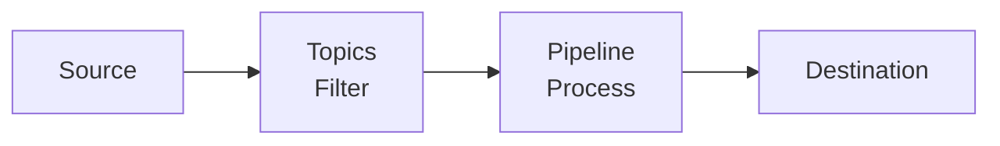

import { Image, Callout, Tabs, Steps } from 'nextra/components'

# Pipelines

Pipelines provide fine-grained control over log event processing. They consist of **topics** (which filter events) and **pipelines** (which process the filtered events through a series of steps). By mixing and rearranging pipeline steps, you can control how your events are transformed before being sent to their destinations.

<Callout type="info">
<strong>Getting Started</strong>: Navigate to <strong>Pipelines</strong> in RunReveal to create your first topic and pipeline, or manage existing ones.
</Callout>

## Pipeline Architecture

### Event Flow
1. **Events arrive** from your configured sources
2. **Topics filter** events based on preconditions
3. **Pipelines process** filtered events through steps
4. **Events are sent** to their final destinations

## Topics: Event Filtering

Topics apply filters to select subsets of events before they enter a pipeline. They use preconditions to determine which events get routed to specific pipelines.

### Topic Preconditions
Topics use preconditions to determine which events get routed to specific pipelines:

- **Source-based**: Route events from specific sources (e.g., `webhook` sources)
- **Field-based**: Route events based on field values
- **Custom criteria**: Any combination of filtering conditions

### Managing Topics

To manage your topics, navigate to the [Pipelines Page](https://app.runreveal.com/dash/pipelines).

**Topic Evaluation Order:**
- Events are evaluated against topics **from top to bottom**
- Events that don't match any custom topics go to the **default RunReveal pipeline**
- Topics can be reordered by dragging them up/down in the list

### Creating a Topic

<Steps>

### Start Topic Creation

Click the **"Create Topic"** button to open the topic creation wizard.

### Configure Topic Details

Each topic needs a name and a precondition. The precondition determines which subset of events will be routed to your topic.

**Example**: The precondition above matches any events coming from `webhook` sources.

### Choose Pipeline Configuration

Configure where your matching events will be processed:

**Options:**
- **Use an existing pipeline**: Reuse pipelines across multiple topics
- **Create a new pipeline**: Start with a fresh pipeline from scratch
- **Copy from an existing pipeline**: Build on top of existing processing

### Configure Pipeline Steps

You're brought to the pipeline editor to configure how events are processed.

Click **Complete** to finish the wizard and set up your new resources.

</Steps>

## Pipelines: Event Processing

Pipelines detail how events are processed before being sent to their final destinations. They consist of steps that are evaluated **in order from top to bottom**. Each step includes a function to apply and a precondition to select which events the step applies to.

## Processing Steps

Pipeline steps are executed in order from top to bottom. Each step can have preconditions to determine which events it applies to.

| Step | Purpose | When to Use |
|------|---------|-------------|
| **[Transform](/logs/log-processing/transforms)** | Modify event data structure and content | • Standardizing data from different sources • Cleaning up field names • Restructuring JSON |
| **[Enrich](/logs/log-processing/enrichments)** | Add additional context to events | • Enhancing events with contextual information for better analysis |
| **[Filter](/logs/log-processing/filtering)** | Apply reusable filter rules | • When you need reusable, configurable filtering rules that can be shared across pipelines • When you want to archive events instead of dropping them |
| **[Detect](/detections/sigma-streaming)** | Run streaming detections (Sigma rules) on events as they are ingested | • Real-time threat detection as events are ingested |
| **Sample** | Reduce event volume by sampling a percentage | • Cost optimization for noisy sources • Performance tuning |
| **Drop** | Remove events from processing | • Simple, pipeline-specific event dropping that doesn't require reusable filter rules |

### Creating a Pipeline

<Steps>

### Access Pipeline Editor

Click **"Add Pipeline"** or edit an existing pipeline to open the pipeline editor.

### Build Your Pipeline

- **Left column**: Your pipeline steps
- **Right column**: Available steps to add
- **Drag and drop**: Add steps from right to left column
- **Reorder**: Drag steps up/down to change evaluation order

### Configure Step Preconditions

Each step can have preconditions to determine which events it applies to.

</Steps>

<Callout type="warning">
<strong>Shared Pipeline Warning</strong>: When editing a pipeline shared between multiple topics, you'll be prompted to unlock it first. Changes affect all matching topics - proceed with caution.
</Callout>

## Precondition Types

Preconditions are used by topics and pipeline steps to determine which events they apply to. All preconditions use the same matching logic.

<Tabs items={['Exact Match', 'Not Equal', 'Regex', 'Is Empty', 'CIDR Match']} defaultIndex="0">

<Tabs.Tab>

### Exact Match
Match exact string values.

**Example:**
- **Field**: `normalized.actor.email`
- **Type**: `exact`
- **Value**: `admin@company.com`

</Tabs.Tab>

<Tabs.Tab>

### Not Equal
Exclude specific values.

**Example:**
- **Field**: `normalized.service.name`
- **Type**: `notEqual`
- **Value**: `health-check`

</Tabs.Tab>

<Tabs.Tab>

### Regex
Pattern matching in log content.

**Example:**
- **Field**: Select `other`, then enter the field path (e.g., `Namespace` or `request.namespace`)
- **Type**: `regex`
- **Value**: `"app_name","value":"Material Security"`

**Note**: When targeting fields in rawLog or custom GJSON paths, select `other` as the field type, then enter the field path directly (e.g., `Namespace` for a top-level field, or `request.namespace` for nested fields).

</Tabs.Tab>

<Tabs.Tab>

### Is Empty
Find events with missing data.

**Example:**
- **Field**: `normalized.src.ip`
- **Type**: `isEmpty`

</Tabs.Tab>

<Tabs.Tab>

### CIDR Match
Network-based filtering using CIDR notation.

**Example:**
- **Field**: `normalized.src.ip`
- **Type**: `cidrMatch`
- **Value**: `10.0.0.0/8`

</Tabs.Tab>

</Tabs>

### Field Targeting

**Standard Fields**: Select from the dropdown for normalized (parsed) fields (e.g., `normalized.actor.email`, `normalized.src.ip`, `normalized.eventName`).

**Custom Fields**: If a field is not a normalized field, you can target it in the 'rawLog' by selecting `other` as the field type, then entering the field path directly:
- Top-level fields: Enter the field name (e.g., `Namespace`)
- Nested fields: Enter the GJSON path (e.g., `request.namespace` or `events.0.parameters.#(name="client_id").value`)

<Callout type="warning">
<strong>Google Workspace Integration</strong>: Processes logs through Google Admin SDK, which changes the JSON structure of rawLog. Use GJSON paths or regex on rawLog for reliable targeting. Field paths may not match original audit log structure.
</Callout>

