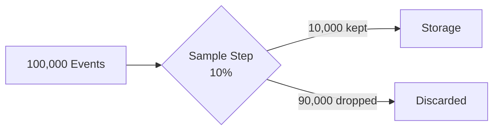

import { Callout, Tabs } from 'nextra/components'

# Sampling

Sampling reduces log volume by keeping only a percentage of matching events. This is useful for cost optimization on high-volume, low-value log sources while maintaining statistical visibility into patterns and trends.

<Callout type="info">
Sampling is configured as a pipeline step. Navigate to **Pipelines** → Edit your pipeline → Add a **Sample** step.
</Callout>

## When to Use Sampling

Sampling is ideal when you need to:

- **Reduce storage costs** for high-volume sources without losing visibility
- **Maintain statistical patterns** while reducing event count
- **Optimize performance** for sources generating millions of events daily
- **Keep representative data** for trend analysis and capacity planning

<Callout type="warning">
<strong>Not for Security-Critical Events</strong>: Don't sample events that require full fidelity for security investigations (authentication failures, privilege escalation, data access). Use sampling only for operational or informational logs.
</Callout>

## How Sampling Works

When you add a Sample step to a pipeline:

1. Events matching the step's preconditions are evaluated
2. A percentage of matching events (e.g., 10%) are kept
3. The remaining events are discarded before reaching storage
4. Non-matching events pass through unaffected



## Configuration

| Setting | Description | Example |
|---------|-------------|---------|
| **Sample Rate** | Percentage of events to keep (1-99%) | 10% |
| **Preconditions** | Which events the sampling applies to | `eventName regex: ^Get.*` |

## Use Cases

<div className="space-y-6 mt-4">

<div className="bg-white dark:bg-gray-800 rounded-2xl border border-gray-200 dark:border-gray-700 shadow-sm overflow-hidden">
  <div className="p-5">
    <h4 className="text-lg font-bold text-gray-900 dark:text-white m-0 mb-3">Sample AWS S3 Data Events</h4>
    
    <div className="text-sm text-gray-600 dark:text-gray-400 mb-4 leading-relaxed">
      S3 data events (GetObject, PutObject, ListObjects) generate extremely high volumes in active environments. Sample 10% to reduce costs while maintaining visibility into access patterns.
    </div>

    <Tabs items={['Sample Event', 'Configuration']}>
      <Tabs.Tab>

```json
{
  "eventName": "GetObject",
  "eventSource": "s3.amazonaws.com",
  "awsRegion": "us-east-1",
  "userIdentity": {
    "arn": "arn:aws:iam::123456789012:role/data-pipeline"
  },
  "requestParameters": {
    "bucketName": "company-data-lake",
    "key": "logs/2024/01/15/events.json"
  }
}
```

      </Tabs.Tab>
      <Tabs.Tab>

```text
Step Type: Sample
Sample Rate: 10%

Precondition:
  Field: eventSource
  Type: exact
  Value: s3.amazonaws.com
```

      </Tabs.Tab>
    </Tabs>

    <div className="mt-4">
      <h5 className="text-sm font-semibold text-gray-700 dark:text-gray-300 mb-2">Cost Impact</h5>
      <div className="space-y-2">
        <div className="flex justify-between items-center py-2 px-3 bg-gray-50 dark:bg-gray-700/50 rounded-lg">
          <span className="text-sm text-gray-600 dark:text-gray-400">Before Sampling</span>
          <span className="text-sm font-mono text-gray-900 dark:text-white">~5M events/day</span>
        </div>
        <div className="flex justify-between items-center py-2 px-3 bg-gray-50 dark:bg-gray-700/50 rounded-lg">
          <span className="text-sm text-gray-600 dark:text-gray-400">After Sampling (10%)</span>
          <span className="text-sm font-mono text-gray-900 dark:text-white">~500K events/day</span>
        </div>
        <div className="flex justify-between items-center py-2 px-3 bg-green-50 dark:bg-green-900/20 rounded-lg">
          <span className="text-sm text-gray-600 dark:text-gray-400">Storage Savings</span>
          <span className="text-sm font-mono text-green-700 dark:text-green-300">~90%</span>
        </div>
      </div>
    </div>
  </div>
</div>

<div className="bg-white dark:bg-gray-800 rounded-2xl border border-gray-200 dark:border-gray-700 shadow-sm overflow-hidden">
  <div className="p-5">
    <h4 className="text-lg font-bold text-gray-900 dark:text-white m-0 mb-3">Sample CloudFlare HTTP Requests</h4>
    
    <div className="text-sm text-gray-600 dark:text-gray-400 mb-4 leading-relaxed">
      CDN and web traffic logs can generate millions of events daily. Sample successful requests while keeping all errors at full fidelity for debugging.
    </div>

    <Tabs items={['Sample Event', 'Configuration']}>
      <Tabs.Tab>

```json
{
  "ClientRequestHost": "api.company.com",
  "ClientRequestMethod": "GET",
  "ClientRequestURI": "/v1/users",
  "EdgeResponseStatus": 200,
  "ClientIP": "203.0.113.50",
  "RayID": "8a1b2c3d4e5f6g7h"
}
```

      </Tabs.Tab>
      <Tabs.Tab>

```text
Step Type: Sample
Sample Rate: 5%

Precondition:
  Field: EdgeResponseStatus
  Type: exact
  Value: 200
```

      </Tabs.Tab>
    </Tabs>

    <Callout type="info">
      By using a precondition that only matches successful (200) responses, all error responses (4xx, 5xx) are kept at full fidelity for debugging and security analysis.
    </Callout>
  </div>
</div>

<div className="bg-white dark:bg-gray-800 rounded-2xl border border-gray-200 dark:border-gray-700 shadow-sm overflow-hidden">
  <div className="p-5">
    <h4 className="text-lg font-bold text-gray-900 dark:text-white m-0 mb-3">Sample VPC Flow Logs</h4>
    
    <div className="text-sm text-gray-600 dark:text-gray-400 mb-4 leading-relaxed">
      VPC Flow Logs capture all network traffic metadata, generating massive volumes. Sample accepted traffic while keeping all rejected connections for security analysis.
    </div>

    <Tabs items={['Sample Event', 'Configuration']}>
      <Tabs.Tab>

```json
{
  "version": 2,
  "account-id": "123456789012",
  "interface-id": "eni-0123456789abcdef0",
  "srcaddr": "10.0.1.100",
  "dstaddr": "10.0.2.50",
  "srcport": 443,
  "dstport": 49152,
  "protocol": 6,
  "packets": 10,
  "bytes": 840,
  "action": "ACCEPT"
}
```

      </Tabs.Tab>
      <Tabs.Tab>

```text
Step Type: Sample
Sample Rate: 5%

Precondition:
  Field: action
  Type: exact
  Value: ACCEPT
```

      </Tabs.Tab>
    </Tabs>

    <div className="mt-4">
      <h5 className="text-sm font-semibold text-gray-700 dark:text-gray-300 mb-2">What's Preserved</h5>
      <div className="space-y-2">
        <div className="flex justify-between items-center py-2 px-3 bg-purple-50 dark:bg-purple-900/20 rounded-lg border border-purple-200 dark:border-purple-800">
          <span className="text-sm text-gray-600 dark:text-gray-400">REJECT events</span>
          <span className="text-sm font-mono text-purple-700 dark:text-purple-300">100% retained</span>
        </div>
        <div className="flex justify-between items-center py-2 px-3 bg-gray-50 dark:bg-gray-700/50 rounded-lg">
          <span className="text-sm text-gray-600 dark:text-gray-400">ACCEPT events</span>
          <span className="text-sm font-mono text-gray-900 dark:text-white">5% sampled</span>
        </div>
      </div>
    </div>
  </div>
</div>

</div>

## Best Practices

1. **Start with higher sample rates** (e.g., 25%) and reduce gradually based on your analysis needs
2. **Use preconditions** to sample only specific event types, keeping security-relevant events at full fidelity
3. **Combine with enrichments** to tag events before sampling decisions
4. **Monitor your dashboards** after enabling sampling to ensure statistical patterns remain visible
5. **Document your sampling strategy** so analysts know which data is sampled

## Sample vs Filter vs Drop

| Action | What Happens | When to Use |
|--------|--------------|-------------|
| **Sample** | Keeps a percentage of events randomly | High-volume operational logs where statistical patterns are sufficient |
| **[Filter](/logs/log-processing/filtering)** | Archives events (still searchable) | Events you rarely need but must retain for compliance |
| **[Drop](/logs/log-processing/dropping)** | Permanently removes events | Events with zero value that should never be stored |

